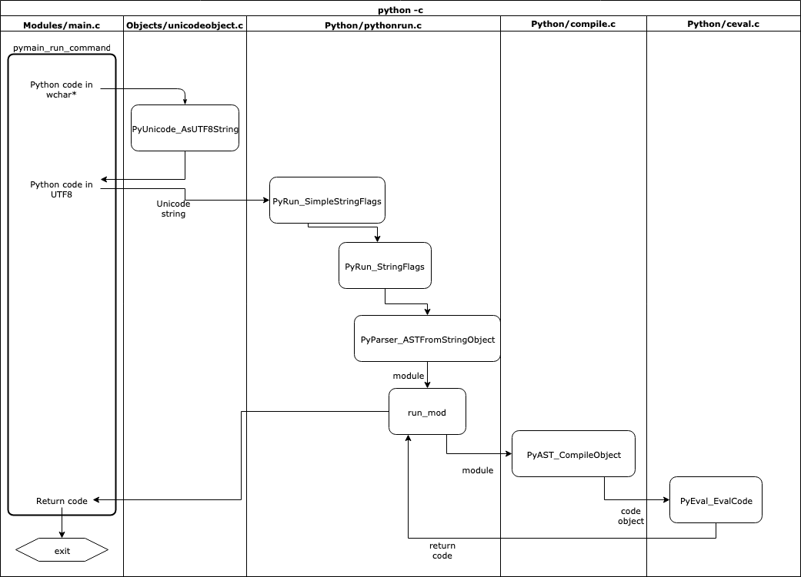

# Cpython源码阅读笔记

*该仓库中的assets文件夹用来储存markdown中的图片*

> Cpython代码命名规则:
>
> -  `Py` 前缀为公共函数, 非静态函数。 Py\_前缀保留用于Py_FatalError等全局服务例程。特定的对象（如特定的对象类型API）使用较长的前缀，例如PyString_用于字符串函数。
> - 公共函数使用大小写混合和下划线，如: `PyObject_GetAttr`, `Py_BuildValue`, `PyExc_TypeError`。
> - 有时，加载器必须能够看到内置函数。使用\_Py前缀，例如_PyObject_Dump。
> - `宏需要使用大小写混合的前缀然后使用大写`，如`PyString_AS_STRING`, `Py_PRINT_RAW`。


## 整体运行流程


1. 

### 运行方式

#### -c

```
./python -c "print('hi')"
```



1.  `pymain_run_command()`中调用`PyUnicode_FromWideChar()`把-c之后的参数从wchar_t *（int *)转化为str。

#### -m

## 初始配置 

### init

1. Python/initconfig.c中 `config_read_env_vars` 函数读取环境变量。

## 编译

​	整体流程分为两步：

1. 遍历树并创建一个控制流图，它表示执行的逻辑顺序
2. 将CFG中的节点转换为更小的可执行语句，即字节码

### 前端

#### Tokens

python实现的tokenize位于 Lib/tokenize.py。

#### Grammer

pegn通过Grammer文件生成解析表，如果修改了Grammer文件，需要重新生成解析表。

pege: EBNF -> NFA -> DFA。


**步骤**

1. Python/pythonrun.c/`PyRun_FileExFlags()`
   1. `PyParser_ASTFromFileObject()`把FILE句柄转化为mod, 类型为[mod_ty](#mod_ty)。
   2. `run_mod()`通过`PyAST_CompileObject`把mod转化为PyCodeObject，然后把其送入`run_eval_code_obj`函数。

### 后端

#### 编译结果 PyCodeObject

​	PyCodeObject为Python编译后的结果，结构如下：

```C
typedef struct {
    PyObject_HEAD
    int co_argcount;            /* #arguments, except *args */
    int co_posonlyargcount;     /* #positional only arguments */
    int co_kwonlyargcount;      /* #keyword only arguments */
    int co_nlocals;             /* #local variables */
    int co_stacksize;           /* #entries needed for evaluation stack */
    int co_flags;               /* CO_..., see below */
    int co_firstlineno;         /* first source line number */
    PyObject *co_code;          /* instruction opcodes */
    PyObject *co_consts;        /* list (constants used) 常量*/
    PyObject *co_names;         /* list of strings (names used) */
    PyObject *co_varnames;      /* tuple of strings (local variable names) 局部变量名集合*/
    PyObject *co_freevars;      /* tuple of strings (free variable names) 实现闭包所需要的东西*/
    PyObject *co_cellvars;      /* tuple of strings (cell variable names) 内部嵌套函数所引用的局部变量名集合*/
    /* The rest aren't used in either hash or comparisons, except for co_name,
       used in both. This is done to preserve the name and line number
       for tracebacks and debuggers; otherwise, constant de-duplication
       would collapse identical functions/lambdas defined on different lines.
    */
    Py_ssize_t *co_cell2arg;    /* Maps cell vars which are arguments. */
    PyObject *co_filename;      /* unicode (where it was loaded from) */
    PyObject *co_name;          /* unicode (name, for reference) */
    PyObject *co_lnotab;        /* string (encoding addr<->lineno mapping) See
                                   Objects/lnotab_notes.txt for details. */
    void *co_zombieframe;       /* for optimization only (see frameobject.c) */
    PyObject *co_weakreflist;   /* to support weakrefs to code objects */
    /* Scratch space for extra data relating to the code object.
       Type is a void* to keep the format private in codeobject.c to force
       people to go through the proper APIs. */
    void *co_extra;

    /* Per opcodes just-in-time cache
     *
     * To reduce cache size, we use indirect mapping from opcode index to
     * cache object:
     *   cache = co_opcache[co_opcache_map[next_instr - first_instr] - 1]
     */

    // co_opcache_map is indexed by (next_instr - first_instr).
    //  * 0 means there is no cache for this opcode.
    //  * n > 0 means there is cache in co_opcache[n-1].
    unsigned char *co_opcache_map;
    _PyOpcache *co_opcache;
    int co_opcache_flag;  // used to determine when create a cache.
    unsigned char co_opcache_size;  // length of co_opcache.
} PyCodeObject;
```

​	编译过程中，每个code block都对应着一个PyCodeObject对象，即PyCodeObject包含该code block经过编译后得到的byte code序列。（Python规定每进入一个新的名字空间就视为进入一个新的code block。）

​	TODO：名字空间的解释（可参考《源码剖析》8.2），.pyc文件的简单介绍


## 执行

#### 执行环境（栈帧模拟）

​	虽然PyCodeObject包含了字节码序列和其他信息，但是却没有包含程序运行时的动态信息，因此在python执行的时候, 虚拟机实际上面对的不是一个 `PyCodeObject` 对象, 而是另一个 `PyFrameObject` 对象，它就是我们说的执行环境, 也是python在高级层次上对栈帧的模拟，x86上程序运行方式如下：


​	PyFrameObject结构如下：

```C

typedef struct _frame {
    PyObject_VAR_HEAD
    struct _frame *f_back;      /* previous frame, or NULL 使新的栈帧在结束之后可以顺利回到旧的栈帧中 */
    PyCodeObject *f_code;       /* code segment */
    PyObject *f_builtins;       /* builtin symbol table (PyDictObject) */
    PyObject *f_globals;        /* global symbol table (PyDictObject) */
    PyObject *f_locals;         /* local symbol table (any mapping) */
    PyObject **f_valuestack;    /* 运行时栈的栈底位置 points after the last local */
    /* Next free slot in f_valuestack.  Frame creation sets to f_valuestack.
       Frame evaluation usually NULLs it, but a frame that yields sets it
       to the current stack top. */
    PyObject **f_stacktop;      /* 运行时栈的栈顶位置 */
    PyObject *f_trace;          /* Trace function */
    char f_trace_lines;         /* Emit per-line trace events? */
    char f_trace_opcodes;       /* Emit per-opcode trace events? */

    /* Borrowed reference to a generator, or NULL */
    PyObject *f_gen;

    int f_lasti;                /* Last instruction if called */
    /* Call PyFrame_GetLineNumber() instead of reading this field
       directly.  As of 2.3 f_lineno is only valid when tracing is
       active (i.e. when f_trace is set).  At other times we use
       PyCode_Addr2Line to calculate the line from the current
       bytecode index. */
    int f_lineno;               /* Current line number */
    int f_iblock;               /* index in f_blockstack */
    char f_executing;           /* whether the frame is still executing */
    PyTryBlock f_blockstack[CO_MAXBLOCKS]; /* for try and loop blocks */

    // 动态内存，维护 局部变量+cell对象集合+free对象集合+运行时栈 所需的空间
    PyObject *f_localsplus[1];  /* locals+stack, dynamically sized */
} PyFrameObject;
```

​	相比于x86下的栈帧，PyFrameObject所包含的信息更多，下面依次分析其中的部分关键成员变量。

​	f_code：存放着待执行的PyCodeObject，可以看到每一个PyFrameObject对象都维护一个PyCodeObject对象，说明一个PyFrameObject是对应着一个code block（*code block的范围可大可小. 可以是整个py文件, 可以是class, 可以是函数*）。

​	f_back：指向上一个PyFrameObject，在实际执行过程中，会把很多个PyFrameObject连接起来，使得新的栈帧在结束之后可以顺利回到旧的栈帧中

​	f_builtins、f_globals、f_locals 分别代表内置symbol table，全局symbol table和局部symbol table，他们均为PyDictObject。

​	运行时环境组织如下，与x86运行时连续的内存空间不同，Python虚拟机运行的时候是离散的内存空间，通过链表串连起来。


#### 虚拟机框架（模拟CPU）

​	执行流程为模拟CPU，进入for循环, 取出第一条字节码之后, 判断指令后执行, 然后一条接一条的从字节流中获取。

​	TODO：稍微结合代码说明一下

#### 运行环境（线程、进程）

​	Python在执行时，可能会有多个线程存在。Python虚拟机是对CPU的模拟可以把他看做软CPU，Python中的所有线程都使用这个软CPU来完成计算工作。真实机器上的任务切换机制对应到Python中，就是使不同的线程轮流使用虚拟机的机制。
​	CPU切换任务时需要保存线程运行环境。对于Python来说，在切换线程之前，同样需要保存关于当前线程的信息。线程状态信息的抽象是通过 `PyThreadState` 对象来实现的, 一个线程将拥有一个`PyThreadState`对象。 `PyThreadState`不是对线程的模拟, 而是对线程状态的抽象。 python的线程仍然使用操作系统的原生线程。对于进程的抽象, 由 `PyInterPreterState` 对象来实现。

​	通常情况下, python只有一个interpreter, 其中维护了一个或多个PyThreadState对象, 这些对象对应的线程轮流使用上面提到的软CPU。 为了实现线程同步, python通过一个全局解释器锁GIL。

​	TODO：稍微介绍一下GIL，包括提出的原因，优缺点等。

​	PyThreadState结构体定义如下：

```C
struct _ts {
    /* See Python/ceval.c for comments explaining most fields */

    struct _ts *prev;
    struct _ts *next;
    PyInterpreterState *interp;

    struct _frame *frame;   // 模拟线程中的函数调用堆栈
    int recursion_depth;
    char overflowed; /* The stack has overflowed. Allow 50 more calls
                        to handle the runtime error. */
    char recursion_critical; /* The current calls must not cause
                                a stack overflow. */
    int stackcheck_counter;

    /* 'tracing' keeps track of the execution depth when tracing/profiling.
       This is to prevent the actual trace/profile code from being recorded in
       the trace/profile. */
    int tracing;
    int use_tracing;

    Py_tracefunc c_profilefunc;
    Py_tracefunc c_tracefunc;
    PyObject *c_profileobj;
    PyObject *c_traceobj;

    /* The exception currently being raised */
    PyObject *curexc_type;
    PyObject *curexc_value;
    PyObject *curexc_traceback;

    /* The exception currently being handled, if no coroutines/generators
     * are present. Always last element on the stack referred to be exc_info.
     */
    _PyErr_StackItem exc_state;

    /* Pointer to the top of the stack of the exceptions currently
     * being handled */
    _PyErr_StackItem *exc_info;

    PyObject *dict;  /* Stores per-thread state */

    int gilstate_counter;

    PyObject *async_exc; /* Asynchronous exception to raise */
    unsigned long thread_id; /* Thread id where this tstate was created */

    int trash_delete_nesting;
    PyObject *trash_delete_later;

    /* Called when a thread state is deleted normally, but not when it
     * is destroyed after fork().
     * Pain:  to prevent rare but fatal shutdown errors (issue 18808),
     * Thread.join() must wait for the join'ed thread's tstate to be unlinked
     * from the tstate chain.  That happens at the end of a thread's life,
     * in pystate.c.
     * The obvious way doesn't quite work:  create a lock which the tstate
     * unlinking code releases, and have Thread.join() wait to acquire that
     * lock.  The problem is that we _are_ at the end of the thread's life:
     * if the thread holds the last reference to the lock, decref'ing the
     * lock will delete the lock, and that may trigger arbitrary Python code
     * if there's a weakref, with a callback, to the lock.  But by this time
     * _PyRuntime.gilstate.tstate_current is already NULL, so only the simplest
     * of C code can be allowed to run (in particular it must not be possible to
     * release the GIL).
     * So instead of holding the lock directly, the tstate holds a weakref to
     * the lock:  that's the value of on_delete_data below.  Decref'ing a
     * weakref is harmless.
     * on_delete points to _threadmodule.c's static release_sentinel() function.
     * After the tstate is unlinked, release_sentinel is called with the
     * weakref-to-lock (on_delete_data) argument, and release_sentinel releases
     * the indirectly held lock.
     */
    void (*on_delete)(void *);
    void *on_delete_data;

    int coroutine_origin_tracking_depth;

    PyObject *async_gen_firstiter;
    PyObject *async_gen_finalizer;

    PyObject *context;
    uint64_t context_ver;

    /* Unique thread state id. */
    uint64_t id;

    /* XXX signal handlers should also be here */

};
```

​	下面依次分析其中的部分关键成员变量。

​	frame: 栈帧列表，模拟线程中函数调用堆栈。

​	当Python虚拟机开始执行时，会将当前线程状态对象中的frame设置为当前的执行环境（frame）。

​	

​	PyInterPreterState结构定义如下：

```C
struct _is {

    struct _is *next;
    struct _ts *tstate_head; // 模拟进程环境中的线程集合

    int64_t id;
    int64_t id_refcount;
    int requires_idref;
    PyThread_type_lock id_mutex;

    int finalizing;

    PyObject *modules;
    PyObject *modules_by_index;
    PyObject *sysdict;
    PyObject *builtins;
    PyObject *importlib;

    /* Used in Python/sysmodule.c. */
    int check_interval;

    /* Used in Modules/_threadmodule.c. */
    long num_threads;
    /* Support for runtime thread stack size tuning.
       A value of 0 means using the platform's default stack size
       or the size specified by the THREAD_STACK_SIZE macro. */
    /* Used in Python/thread.c. */
    size_t pythread_stacksize;

    PyObject *codec_search_path;
    PyObject *codec_search_cache;
    PyObject *codec_error_registry;
    int codecs_initialized;

    /* fs_codec.encoding is initialized to NULL.
       Later, it is set to a non-NULL string by _PyUnicode_InitEncodings(). */
    struct {
        char *encoding;   /* Filesystem encoding (encoded to UTF-8) */
        char *errors;     /* Filesystem errors (encoded to UTF-8) */
        _Py_error_handler error_handler;
    } fs_codec;

    PyConfig config;
#ifdef HAVE_DLOPEN
    int dlopenflags;
#endif

    PyObject *dict;  /* Stores per-interpreter state */

    PyObject *builtins_copy;
    PyObject *import_func;
    /* Initialized to PyEval_EvalFrameDefault(). */
    _PyFrameEvalFunction eval_frame;

    Py_ssize_t co_extra_user_count;
    freefunc co_extra_freefuncs[MAX_CO_EXTRA_USERS];

#ifdef HAVE_FORK
    PyObject *before_forkers;
    PyObject *after_forkers_parent;
    PyObject *after_forkers_child;
#endif
    /* AtExit module */
    void (*pyexitfunc)(PyObject *);
    PyObject *pyexitmodule;

    uint64_t tstate_next_unique_id;

    struct _warnings_runtime_state warnings;

    PyObject *audit_hooks;
};
```


​	进程, 线程, 栈帧关系大致如下:


TODO：

表达式

控制流

函数机制

类机制

运行环境初始化

模块加载机制

多线程机制

内存管理机制


## 部分类型的含义

### <a name="mod_ty">mod_ty</a>

Python中5种模块类型之一的容器结构，是AST的实例，包含有：

1. `Module`
2. `Interactive`
3. `Expression`
4. `FunctionType`
5. `Suite`

### <a name="PyObject">PyObject</a>

所有Python的对象都是PyObject的拓展，包含着把一个指针转化为对象的所有信息。所有对象都可以转化为PyObject*，对对象成员的访问需要使用 Py_TYPE和Py_REFCNT。


## 部分宏的含义

### <a name="ADDOP_JABS">ADDOP_JABS</a>

**ADD** **O**peration with **J**ump to an **ABS**olute position

### ADDOP_JREL

**ADD** **O**peration with **J**ump to a **REL**ative position

### <a name="Py_TYPE()">Py_TYPE</a>

用于访问`PyObject`中的 `ob_type` 

```
(((PyObject*)(o))->ob_type)
```

### Py_REFCNT(o)

用于访问`PyObject`中的 `ob_refcnt`

```
(((PyObject*)(o))->ob_refcnt)
```