# Cpython源码阅读笔记

*该仓库中的assets文件夹用来储存markdown中的图片*

 Cpython代码命名规则:

 -  `Py` 前缀为公共函数, 非静态函数。 `Py_`前缀保留用于`Py_FatalError`等全局服务例程。特定的对象（如特定的对象类型API）使用较长的前缀，例如`PyString_`用于字符串函数。
 - 公共函数使用大小写混合和下划线，如: `PyObject_GetAttr`, `Py_BuildValue`, `PyExc_TypeError`。
 - 有时，加载器必须能够看到内置函数。使用`_Py`前缀，例如`_PyObject_Dump`。
 - 宏需要使用大小写混合的前缀然后使用大写，如`PyString_AS_STRING`, `Py_PRINT_RAW`。

## CPython介绍

CPython是Python的**官方**实现，使用C编写的，我们一般所运行的Python均为CPython。

除此之外还有其他实现比如PyPy（Python实现的Python），Cyhton（可简单的认为就是给Python加上了静态类型，会直接编译为二进制程序，性能较Python会有很大提升），Jython（Java实现的Python）。

该文档所选代码版本为 Python 3.8.0, 运行环境为Ubuntu。

## 整体运行流程

一共有五种方式可以运行Python，分别如下：

- 通过-c执行单个命令
- 通过-m运行模块
- 运行文件
- 通过pipe运行stdin的输入
- 通过交互式解释器运行

整体的执行过程如下，该文档以解释.py文件的运行流程为主。

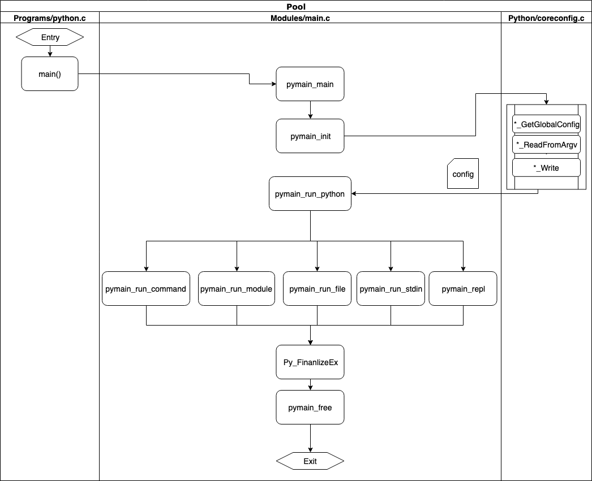

## 初始配置 

> 待修改内容：
>
> **多参考3.8.0文档，源码剖析仅为参考，部分代码已经很不相同**
>
> 1. 小标题较为混乱，可一考虑pymain_init中进行的几个最重要的操作作为小标题：
>    1. _PyRuntime_Initialize（运行环境初始化）：包括线程初始化，内存分配器初始化等，可以把这些内容移到这个小目录下
>    2. PyPreConfig_InitPythonConfig（PyPreConfig初始化）
>    3. PyConfig_InitPythonConfig（PyConfig初始化）
>    4. Py_InitializeFromConfig（根据config初始化，包括）
>
> 2. PyPreConfig，PyConfig的区别和功能要介绍一下，以及他俩共同起的作用，比如
>
>    > [`PyPreConfig_InitPythonConfig()`](#c.PyPreConfig_InitPythonConfig) and [`PyConfig_InitPythonConfig()`](#c.PyConfig_InitPythonConfig) functions create a configuration to build a customized Python which behaves as the regular Python.
>    >
>    > Environments variables and command line arguments are used to configure Python, whereas global configuration variables are ignored.
>
> 3. 部分函数调用与实际运行流程不符合
>
> 
>4. 可以在这一部分先简单介绍下python的线程和进程，就不用再详细介绍和贴图了，然后做一个链接跳转到我写的那一部分，
>    
>5. 我们以运行文件的流程为主介绍，在后面的举例以文件的为主（不强求）
> 
> 6. 目录修改建议：
> 
> 初始配置
> 
>    1. 运行环境初始化（_PyRuntime_Initialize）
>      1. 设置默认内存分配器（_PyMem_SetDefaultAllocator）
>          2. 运行环境状态初始化（_PyRuntimeState_Init_impl）
>         1. 设置GC
>          2. 设置递归深度
>         3. 设置GIL锁
>       3. 设置内存分配器（PyMem_SetAllocator）
>   2. PyPreConfig初始化（PyPreConfig_InitPythonConfig）
>       1. ...
>   3. PyConfig初始化（PyConfig_InitPythonConfig）
>          1. ...
>   4. 根据config初始化Python（Py_InitializeFromConfig）
>       1. ...

### init config
在执行任何Python代码之前，首先要建立基础的配置。
运行时的配置是在`Include/cpython/initconfig.h`中定义的数据结构PyConfig，其部分结构如下：

```
typedef struct {
    int _config_version;  /* Internal configuration version,
                             used for ABI compatibility */
    int _config_init;     /* _PyConfigInitEnum value */
    
    int faulthandler;
    int tracemalloc;
    int import_time;        /* PYTHONPROFILEIMPORTTIME, -X importtime */
    int show_ref_count;     /* -X showrefcount */
    int show_alloc_count;   /* -X showalloccount */
    int dump_refs;          /* PYTHONDUMPREFS */
    int malloc_stats;       /* PYTHONMALLOCSTATS */
    wchar_t *filesystem_encoding;
    wchar_t *filesystem_errors;
    wchar_t *pycache_prefix;  /* PYTHONPYCACHEPREFIX, -X pycache_prefix=PATH */
    int parse_argv;           /* Parse argv command line arguments? */

    PyWideStringList argv;
    wchar_t *program_name;
    PyWideStringList xoptions;     /* Command line -X options */
    PyWideStringList warnoptions;  /* Warnings options */
    int site_import;
    int bytes_warning;
    int inspect;
    int interactive;
    int optimization_level;
    int parser_debug;
    int write_bytecode;
    int verbose;
    int quiet;
    int user_site_directory;
    int configure_c_stdio;
    int buffered_stdio;
    wchar_t *stdio_encoding;
    wchar_t *stdio_errors;

#ifdef MS_WINDOWS
    int legacy_windows_stdio;
#endif

    wchar_t *check_hash_pycs_mode;

    int pathconfig_warnings;

    wchar_t *pythonpath_env; /* PYTHONPATH environment variable */
    wchar_t *home; 

    int module_search_paths_set;  /* If non-zero, use module_search_paths */
    PyWideStringList module_search_paths;  

    wchar_t *executable;        /* sys.executable */
    wchar_t *base_executable;   /* sys._base_executable */
    wchar_t *prefix;            /* sys.prefix */
    wchar_t *base_prefix;       /* sys.base_prefix */
    wchar_t *exec_prefix;       /* sys.exec_prefix */
    wchar_t *base_exec_prefix;  /* sys.base_exec_prefix */

    int skip_source_first_line;

    wchar_t *run_command;   /* -c command line argument */
    wchar_t *run_module;    /* -m command line argument */
    wchar_t *run_filename;  /* Trailing command line argument without -c or -m */

    ……

} PyConfig;
```

PyConfig中定义了运行时的基本配置，包括：
- faulthandler：是否支持错误处理
- bytes_warning：字节警告信息
- malloc_stats：内存分配状态
- use_environment、pythonpath_env：运行时设置的环境变量信息
- executable等：设置sys信息
- module_search_paths：设置sys.path信息
- 定义执行的方式
  - run_command：输入参数为-c对应command模式
  - run_module：输入参数为-m对应module模式
  - run_filename：除了-c和-m之外为filename模式
- 各种模式的运行时标志，例如调试和优化模式
- 提供了执行模式，例如是否传递文件名stdin或模块名称

配置数据结构的主要功能是在CPython运行时启用和禁用各种功能。

文件`Python/initconfig.c`是`initconfig.h`对应的C文件，建立了从环境变量和运行时命令行标志读取设置的逻辑。
下面介绍`initconfig.c`中部分重要的函数：
-  `config_read_env_vars` 函数读取环境变量并将其用于分配配置中设置的值。
```
static PyStatus
config_read_env_vars(PyConfig *config)
{
    PyStatus status;
    int use_env = config->use_environment;

    /* Get environment variables */
    _Py_get_env_flag(use_env, &config->parser_debug, "PYTHONDEBUG");
    _Py_get_env_flag(use_env, &config->verbose, "PYTHONVERBOSE");
    _Py_get_env_flag(use_env, &config->optimization_level, "PYTHONOPTIMIZE");
    _Py_get_env_flag(use_env, &config->inspect, "PYTHONINSPECT");

    ……

    return _PyStatus_OK();
}
```
- _PyConfig_Write函数-设置Py_xxx全局配置变量、初始化C标准流(stdin, stdout, stderr)
- config_read_cmdline函数，读取命令行参数，如-c、-m、-V，返回值为PyStatus
- config_parse_cmdline函数，根据输入从命令行参数设置处理模式，返回值为PyStatus
```
static PyStatus
config_parse_cmdline(PyConfig *config, PyWideStringList *warnoptions,
                     Py_ssize_t *opt_index)
{

        if (c == 'c') {
            if (config->run_command == NULL) {
                /* -c is the last option; following arguments
                   that look like options are left for the
                   command to interpret. */
                size_t len = wcslen(_PyOS_optarg) + 1 + 1;
                wchar_t *command = PyMem_RawMalloc(sizeof(wchar_t) * len);
                if (command == NULL) {
                    return _PyStatus_NO_MEMORY();
                }
                memcpy(command, _PyOS_optarg, (len - 2) * sizeof(wchar_t));
                command[len - 2] = '\n';
                command[len - 1] = 0;
                config->run_command = command;
            }
            break;
        }
        ……

        switch (c) {
        case 0:
            // Handle long option.
            assert(longindex == 0); // Only one long option now.
            if (wcscmp(_PyOS_optarg, L"always") == 0
                || wcscmp(_PyOS_optarg, L"never") == 0
                || wcscmp(_PyOS_optarg, L"default") == 0)
            {
                status = PyConfig_SetString(config, &config->check_hash_pycs_mode,
                                            _PyOS_optarg);
                if (_PyStatus_EXCEPTION(status)) {
                    return status;
                }
            } else {
                fprintf(stderr, "--check-hash-based-pycs must be one of "
                        "'default', 'always', or 'never'\n");
                config_usage(1, program);
                return _PyStatus_EXIT(2);
            }
            break;

        case 'b':
            config->bytes_warning++;
            break;

        ……

        default:
            /* unknown argument: parsing failed */
            config_usage(1, program);
            return _PyStatus_EXIT(2);
        }
    } while (1);

   ……

    return _PyStatus_OK();
}
```
### 运行环境初始化
这里我们介绍python应用程序被执行时，是如何一步一步开始执行程序、导入初始配置config
、建立解释器的进程和线程、维护多进程多线程，以及最终启动python字节码虚拟机，开始执行字节码指令的过程。

python在运行时，首先进入位于`Programs/python.c`中的函数wmain，然后进入位于`Modules/main.c`的函数Py_Main中，再进入函数pymain_main中
```
static int
pymain_main(_PyArgv *args)
{
    PyStatus status = pymain_init(args);
    if (_PyStatus_IS_EXIT(status)) {
        pymain_free();
        return status.exitcode;
    }
    if (_PyStatus_EXCEPTION(status)) {
        pymain_exit_error(status);
    }

    return Py_RunMain();
}
```
其中pymain_init函数用于运行环境的初始化工作。

下面解释Python在启动之初进行的工作，即Python运行环境的初始化：
Python启动之后，其初始化从于`Modules/main.c`的函数pymain_init开始：
```
static PyStatus
pymain_init(const _PyArgv *args)
{
    PyStatus status;
    status = _PyRuntime_Initialize();
    ……
    PyPreConfig preconfig;
    PyPreConfig_InitPythonConfig(&preconfig);
    status = _Py_PreInitializeFromPyArgv(&preconfig, args);

    PyConfig config;
    status = PyConfig_InitPythonConfig(&config);
    if (_PyStatus_EXCEPTION(status)) {
        goto done;
    }
    ……
    status = Py_InitializeFromConfig(&config);
    if (_PyStatus_EXCEPTION(status)) {
        goto done;
    }
    status = _PyStatus_OK();

done:
    PyConfig_Clear(&config);
    return status;
}
```

进行python运行环境的初始化，其作用包括启动基本进程和线程、系统module初始化，以及其他部分init工作。

下面详细介绍初始化线程环境和系统module初始化这两个部分：

#### 初始化线程环境
在初始化线性环境之前，我们先介绍Python的运行模型，即线程模型。

在虚拟器运行的任意时刻，Python运行的整体环境如下：
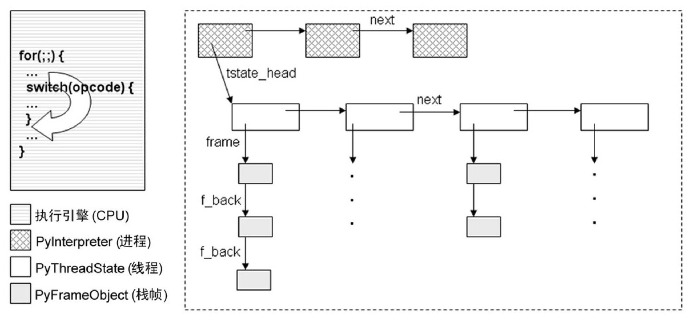
Python中，实现的这个虚拟机可以看作是对CPU的抽象，Python在的所有线程都在这个模拟CPU下完成工作。
其中有两个关键的数据结构，其声明位于`Include/pystate.h`：

- PyInterpreterState：对进程进行模拟；
```
typedef struct _is {
    struct _is *next;
    struct _ts *tstate_head;

    PyObject *modules;
    PyObject *sysdict;
    PyObject *builtins;
    ……
} PyInterpreterState;
```
其中的`struct _ts *tstate_head;`模拟了进程环境中的线程集合。
- PyThreadState：对线程进行模拟。
```
typedef struct _ts {
    struct _ts *next;
    PyInterpreterState *interp;
    struct _frame *frame; 
    int recursion_depth;
    ……
    PyObject *dict;
    ……
    long thread_id;
} PyThreadState;
```
其中的`struct _frame *frame;`模拟了线程中的函数调用堆栈，对应的是PyFrameObject(_frame)对象。
在每个PyThreadState对象中，会维护一个栈帧的列表，以与PyThreadState对象的线程中的函数调用机制对应。

在上述所说的pymain_init函数中，调用位于`/Python/pylifecycle.c`的函数_PyRuntime_Initialize，
再进入_PyRuntimeState_Init函数，从而调用位于`Python/pystate.c`中的函数_PyRuntimeState_Init_impl，
对虚拟机进行部分初始化工作，包括为其运行环境分配空间等。

```
static PyStatus
_PyRuntimeState_Init_impl(_PyRuntimeState *runtime)
{
    ……
    memset(runtime, 0, sizeof(*runtime));
    PyPreConfig_InitPythonConfig(&runtime->preconfig);
    runtime->gilstate.check_enabled = 1;
    runtime->gilstate.autoTSSkey = initial;

    runtime->interpreters.mutex = PyThread_allocate_lock();
    if (runtime->interpreters.mutex == NULL) {
        return _PyStatus_ERR("Can't initialize threads for interpreter");
    }
    runtime->interpreters.next_id = -1;
    ……
    return _PyStatus_OK();
}
```

在上述操作完成之后，`Modules/main.c`的函数pymain_init继续执行。
在执行语句`status = Py_InitializeFromConfig(&config)`时，完成关键的初始化操作，
包括从config中读取配置信息、进程初始化、线程初始化，以及系统module初始化等操作。
```
PyStatus
Py_InitializeFromConfig(const PyConfig *config)
{
    ……
    PyStatus status;
    status = _PyRuntime_Initialize();
    if (_PyStatus_EXCEPTION(status)) {
        return status;
    }
    _PyRuntimeState *runtime = &_PyRuntime;
    PyInterpreterState *interp = NULL;
    status = pyinit_core(runtime, config, &interp);
    config = &interp->config;
    ……
    return _PyStatus_OK();
}

```
该函数调用函数pyinit_core，包括读取config等工作：
```
static PyStatus
pyinit_core(_PyRuntimeState *runtime,
            const PyConfig *src_config,
            PyInterpreterState **interp_p)
{
    ……
    status = PyConfig_Read(&config);
    if (!runtime->core_initialized) {
        status = pyinit_config(runtime, interp_p, &config);
    }
    ……
    return status;
}
```
其中调用函数pyinit_config:
```
static PyStatus
pyinit_config(_PyRuntimeState *runtime,
              PyInterpreterState **interp_p,
              const PyConfig *config)
{
    PyInterpreterState *interp;
    _PyConfig_Write(config, runtime);
    PyStatus status = pycore_init_runtime(runtime, config);
    status = pycore_create_interpreter(runtime, config, &interp);
    ……
    status = pycore_init_builtins(interp);
    ……
    /* Only when we get here is the runtime core fully initialized */
    runtime->core_initialized = 1;
    return _PyStatus_OK();
}
```
其中调用函数pycore_create_interpreter，
```
static PyStatus
pycore_create_interpreter(_PyRuntimeState *runtime,
                          const PyConfig *config,
                          PyInterpreterState **interp_p)
{
    PyInterpreterState *interp = PyInterpreterState_New();
    ……
    config = &interp->config;
    PyThreadState *tstate = PyThreadState_New(interp);
    ……
    /* Create the GIL */
    PyEval_InitThreads();
    return _PyStatus_OK();
}
```

函数pycore_create_interpreter中调用PyInterpreterState_New函数，
创建一个新的PyInterpreterState对象，作为Python解释器的原始进程。该函数位于`Python/pystate.c`中：
```
static PyInterpreterState *interp_head = NULL;

PyInterpreterState* PyInterpreterState_New(void)
{
    PyInterpreterState *interp = malloc(sizeof(PyInterpreterState));
    if (interp != NULL) {
        HEAD_INIT();
        interp->modules = NULL;
        ……
        HEAD_LOCK();
        interp->next = interp_head;
        interp_head = interp;
        HEAD_UNLOCK();
    }
    return interp;
}

```

在Python的运行时环境中，有一个全局的管理PyInterpreterState对象链表的指针：interp_head。Python
虚拟机运行过程中，所有的PyInterpreterState对象通过next指针形成一个链表结构，其表头即为interp_head。


在初始化进程对象之后，pycore_create_interpreter函数为该进程初始化一个线程对象，调用PyThreadState_New函数：
```
PyThreadState* PyThreadState_New(PyInterpreterState *interp)
{
    PyThreadState *tstate = (PyThreadState *)malloc(sizeof(PyThreadState));
    if (_PyThreadState_GetFrame == NULL)
        _PyThreadState_GetFrame = threadstate_getframe;

    if (tstate != NULL) {
        tstate->interp = interp;
        tstate->frame = NULL;
        tstate->thread_id = PyThread_get_thread_ident();
        ……
        HEAD_LOCK();
        tstate->next = interp->tstate_head;
        interp->tstate_head = tstate;
        HEAD_UNLOCK();
    }
    return tstate;
}

```
该函数的作用是为线程申请内存，创建PyThread- State对象，并对其中各个域进行初始化操作。
其中的
- _PyThreadState_GetFrame设置用于获得线程中函数调用栈的操作
- tstate->interp用于在PyThreadState对象中关联PyInterpreterState对象
- tstate->next用于在PyInterpreterState对象中关联PyThreadState对象。

此外，在PyThreadState结构体中，也存在一个next指针，用于维护PyThreadState对象列表，为Python实现多线程提供基础。

将Python的进程对象与线程对象联系起来，这样就得到了虚拟机初始化后的进程与线程关系，如下图所示：
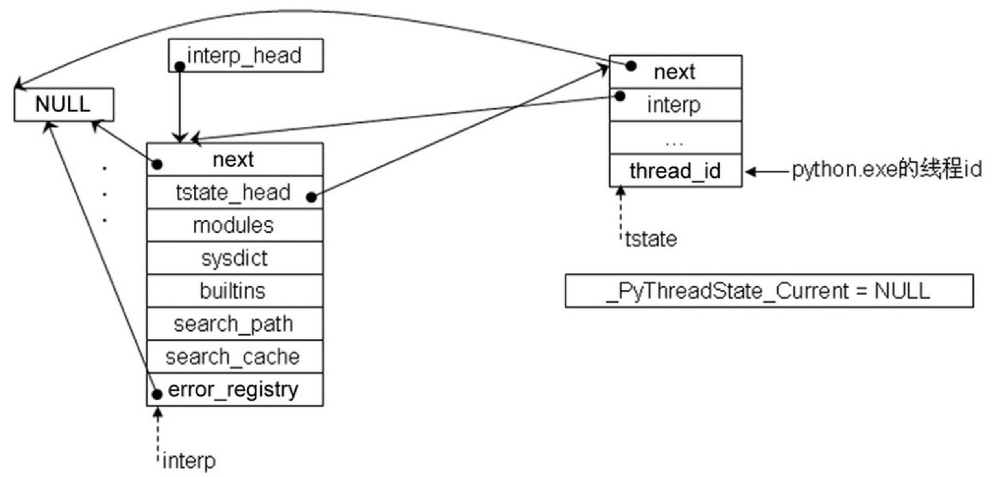

#### 系统module对象初始化
系统的module是指在Python虚拟机创建之初，系统内部初始化的一部分对象，例如：dir对象、list对象，以及一系列sys对象。
这些对象存在于Python虚拟机初始化时创建的一个名字空间，其创建的详细过程如下：

在上述初始化过程的函数`pyinit_config`中，当Python通过`pycore_create_interpreter`函数创建了PyInterpreterState和PyThreadState对象之后，
就会调用`pycore_init_builtins`函数对builtin进行设置，然后系统调用`Python/bltinmodule.c`中的函数`_PyBuiltin_Init`
来进一步设置系统的__builtin__ module，函数部分内容如下：

```
PyObject* _PyBuiltin_Init(void)
{
    PyObject *mod, *dict, *debug;
    mod = _PyModule_CreateInitialized(&builtinsmodule, PYTHON_API_VERSION);
    if (mod == NULL)
        return NULL;
    dict = PyModule_GetDict(mod);
#define SETBUILTIN(NAME, OBJECT) \
    if (PyDict_SetItemString(dict, NAME, (PyObject *)OBJECT) < 0)   \
        return NULL;

    SETBUILTIN("None",      Py_None);
    ……
    SETBUILTIN("dict",      &PyDict_Type);
    ……
    SETBUILTIN("int",       &PyInt_Type);
    SETBUILTIN("list",      &PyList_Type);
    ……
    return mod;
#undef SETBUILTIN
}

```
其中：
- mod =  _PyModule_CreateInitialized(……)：创建PyModuleObject对象，在Python中，module正是通过这个对象来实现的；
- dict = PyModule_GetDict(mod)：设置module，将Python中所有的类型对象全部加载到新创建的__builtin__ module中。

下面详细解释一下PyModuleObject对象对象创建的过程，主要由位于`Objects/moduleobject.c`的函数_PyModule_CreateInitialized完成：
```
PyObject *
_PyModule_CreateInitialized(struct PyModuleDef* module, int module_api_version)
{
    const char* name;
    PyModuleObject *m;
    ……
    name = _Py_PackageContext;
    if ((m = (PyModuleObject*)PyModule_New(name)) == NULL)
        return NULL;

    if (module->m_size > 0) {
        m->md_state = PyMem_MALLOC(module->m_size);
        if (!m->md_state) {
            PyErr_NoMemory();
            Py_DECREF(m);
            return NULL;
        }
        memset(m->md_state, 0, module->m_size);
    }

    if (module->m_methods != NULL) {
        if (PyModule_AddFunctions((PyObject *) m, module->m_methods) != 0) {
            Py_DECREF(m);
            return NULL;
        }
    }
    if (module->m_doc != NULL) {
        if (PyModule_SetDocString((PyObject *) m, module->m_doc) != 0) {
            Py_DECREF(m);
            return NULL;
        }
    }
    m->md_def = module;
    return (PyObject*)m;
}
```
一个完整的python module如下图所示：
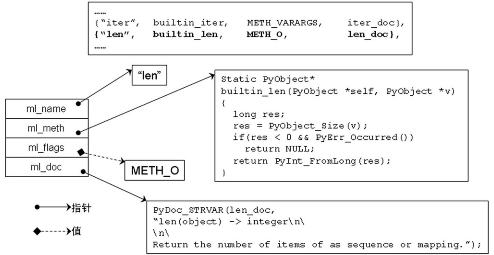

module创建过程中主要分为4个步骤：
- 创建module对象：

这一步骤通过调用PyModule_New函数进行系统module的创建，其中的_Py_PackageContext是导入package内的全部完整module name：
```
PyObject *
PyModule_New(const char *name)
{
    PyObject *nameobj, *module;
    nameobj = PyUnicode_FromString(name);
    if (nameobj == NULL)
        return NULL;
    module = PyModule_NewObject(nameobj);
    Py_DECREF(nameobj);
    return module;
}
```

- 为创建的module对象分配空间：

该步骤根据新创建的module的size，申请内存空间。通过以下代码完成：
```
 if (module->m_size > 0) {
        m->md_state = PyMem_MALLOC(module->m_size);
        if (!m->md_state) {
            PyErr_NoMemory();
            Py_DECREF(m);
            return NULL;
        }
        memset(m->md_state, 0, module->m_size);
    }
```

- 为新创建的module对象添加对应的方法：

该步骤对应的调用的函数是PyModule_AddFunctions：
```
int
PyModule_AddFunctions(PyObject *m, PyMethodDef *functions)
{
    int res;
    PyObject *name = PyModule_GetNameObject(m);
    if (name == NULL) {
        return -1;
    }

    res = _add_methods_to_object(m, name, functions);
    Py_DECREF(name);
    return res;
}
```
其中参数PyMethodDef *functions由调用过程中传递的module->m_methods确定。

- 将新创建的module对象添加到Python的全局module集合中：

该步骤的实现是通过调用函数PyModule_SetDocString实现的：
```
int
PyModule_SetDocString(PyObject *m, const char *doc)
{
    PyObject *v;
    _Py_IDENTIFIER(__doc__);

    v = PyUnicode_FromString(doc);
    if (v == NULL || _PyObject_SetAttrId(m, &PyId___doc__, v) != 0) {
        Py_XDECREF(v);
        return -1;
    }
    Py_DECREF(v);
    return 0;
}

```

建立python虚拟机内置的完整__builtin__ module，如下图：
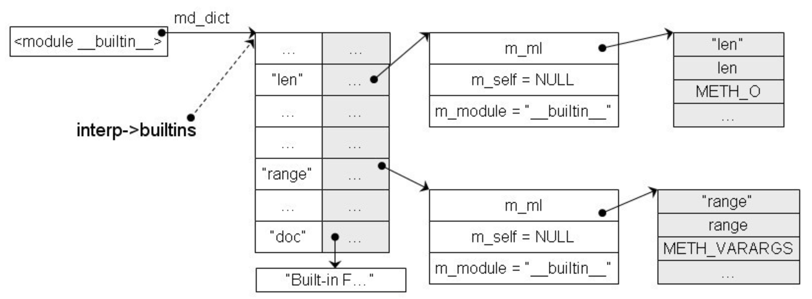

python虚拟机在初始化时，除了要初始化__builtin__ module对象之外，还要初始化sys module，其创建过程类似__builtin__ module，
由函数`pyinit_config`调用位于`Python/sysmodule.c`中的函数_PySys_Create完成：
```
PyStatus
_PySys_Create(_PyRuntimeState *runtime, PyInterpreterState *interp,
              PyObject **sysmod_p)
{
    PyObject *modules = PyDict_New();
    interp->modules = modules;

    PyObject *sysmod = _PyModule_CreateInitialized(&sysmodule, PYTHON_API_VERSION);

    PyObject *sysdict = PyModule_GetDict(sysmod);

    Py_INCREF(sysdict);
    interp->sysdict = sysdict;

    if (PyDict_SetItemString(sysdict, "modules", interp->modules) < 0) {
        return _PyStatus_ERR("can't initialize sys module");
    }

    PyStatus status = _PySys_SetPreliminaryStderr(sysdict);
    if (_PyStatus_EXCEPTION(status)) {
        return status;
    }

    status = _PySys_InitCore(runtime, interp, sysdict);
    ……

    *sysmod_p = sysmod;
    return _PyStatus_OK();
}
```
其核心为调用函数`_PyModule_CreateInitialized(&sysmodule, PYTHON_API_VERSION)`创建对应的sys module。其中，
Python的module集合interp->modules是一个PyDictObject对象，用于维护(module name, PyModuleObject)元素。
创建完__builtin__ module和sys module之后，PyInterpreterState对象和PyThreadState对象在内存中的情形如图所示：
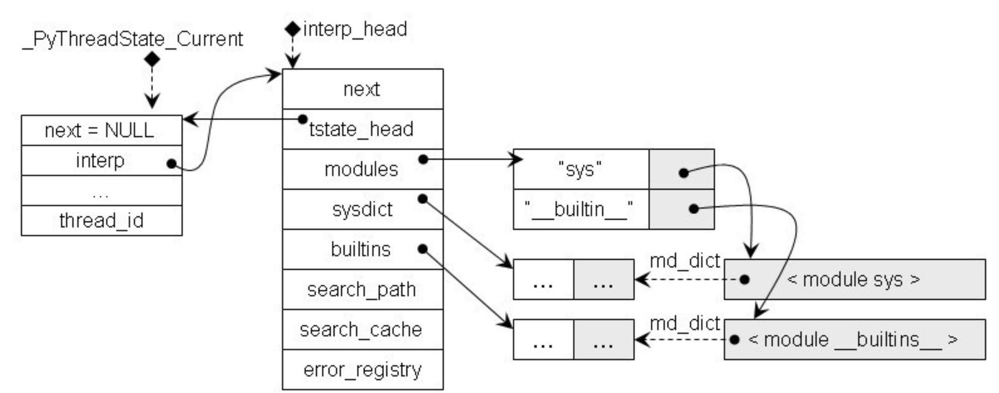
然后再进行一些其他的初始化操作，包括：设置module搜索路、设置site-specific的module的搜索路径等，用于设置sys路径、引用第三方库等工作。

在完成Python中基本的初始化工作之后，我们得到如下初始化环境：
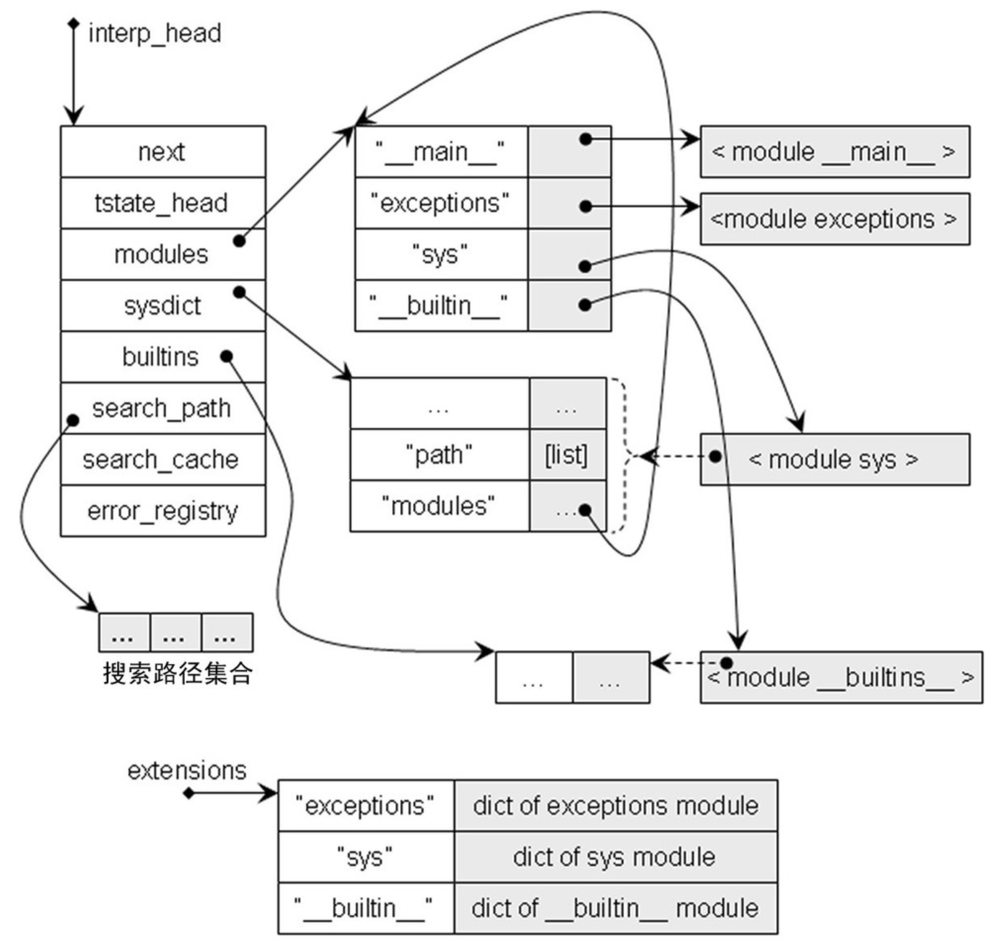

#### 激活Python虚拟机
完成上述的python进程线程初始化和module初始化之后，我们还需要对虚拟机进行激活，进入到字节码虚拟机之后，才完成真正的初始化工作。

在位于`Modules/main.c`的函数Py_Main的初始化工作pymain_init完成之后，进入函数Py_RunMain，然后调用函数pymain_run_python，
根据输入的参数启动虚拟机：
```
static void
pymain_run_python(int *exitcode)
{
    PyInterpreterState *interp = _PyInterpreterState_GET_UNSAFE();
    PyConfig *config = &interp->config;
   ……
    if (config->run_command) {
        *exitcode = pymain_run_command(config->run_command, &cf);
    }
    else if (config->run_module) {
        *exitcode = pymain_run_module(config->run_module, 1);
    }
    else if (main_importer_path != NULL) {
        *exitcode = pymain_run_module(L"__main__", 0);
    }
    else if (config->run_filename != NULL) {
        *exitcode = pymain_run_file(config, &cf);
    }
    else {
        *exitcode = pymain_run_stdin(config, &cf);
    }
    ……
    Py_XDECREF(main_importer_path);
}
```
以命令行启动为例：
程序进入函数pymain_run_command中：
```
static int
pymain_run_command(wchar_t *command, PyCompilerFlags *cf)
{
    PyObject *unicode, *bytes;
    int ret;
    unicode = PyUnicode_FromWideChar(command, -1);
    ……
    bytes = PyUnicode_AsUTF8String(unicode);
    ret = PyRun_SimpleStringFlags(PyBytes_AsString(bytes), cf);
    ……

    return pymain_exit_err_print();
}

```
调用PyRun_SimpleStringFlags，然后进一步调研函数PyRun_StringFlags：
```
PyObject *
PyRun_StringFlags(const char *str, int start, PyObject *globals,
                  PyObject *locals, PyCompilerFlags *flags)
{
    PyObject *ret = NULL;
    mod_ty mod;
    PyArena *arena;
    PyObject *filename;

    filename = _PyUnicode_FromId(&PyId_string); /* borrowed */
    if (filename == NULL)
        return NULL;

    arena = PyArena_New();
    if (arena == NULL)
        return NULL;

    mod = PyParser_ASTFromStringObject(str, filename, start, flags, arena);
    if (mod != NULL)
        ret = run_mod(mod, filename, globals, locals, flags, arena);
    PyArena_Free(arena);
    return ret;
}
```
其中：
- arena = PyArena_New()：读取用户在命令行的输入
- mod = PyParser_ASTFromStringObject(……)：对用户在交互式环境下输入的Python语句进行编译，构造与Python语句对应的抽象语法树（AST）
- run_mode：在run_mode中，将最终完成对用户输入语句的执行动作
- 输入参数：作为Python虚拟机开始执行时当前活动的frame对象的local名字空间和global名字空间

在run_mode函数中：
```
static PyObject *
run_mod(mod_ty mod, PyObject *filename, PyObject *globals, PyObject *locals,
            PyCompilerFlags *flags, PyArena *arena)
{
    PyCodeObject *co;
    PyObject *v;
    co = PyAST_CompileObject(mod, filename, flags, -1, arena);
    if (co == NULL)
        return NULL;

    if (PySys_Audit("exec", "O", co) < 0) {
        Py_DECREF(co);
        return NULL;
    }

    v = run_eval_code_obj(co, globals, locals);
    Py_DECREF(co);
    return v;
}
```
- co：基于AST编译字节码指令序列，创建PyCodeObject对象
- v：创建PyFrameObject对象，执行PyCodeObject对象中的字节码指令序列

程序通过函数run_eval_code_obj再调用函数PyEval_EvalCode中的函数PyEval_EvalCodeEx，用于激活字节码虚拟机：
```
PyObject *
PyEval_EvalCodeEx(……)
{
    return _PyEval_EvalCodeWithName(……);
}
```
在函数_PyEval_EvalCodeWithName中：
```

PyObject *
_PyEval_EvalCodeWithName(PyObject *_co, PyObject *globals, PyObject *locals,
           PyObject *const *args, Py_ssize_t argcount,
           PyObject *const *kwnames, PyObject *const *kwargs,
           Py_ssize_t kwcount, int kwstep,
           PyObject *const *defs, Py_ssize_t defcount,
           PyObject *kwdefs, PyObject *closure,
           PyObject *name, PyObject *qualname)
{
    PyCodeObject* co = (PyCodeObject*)_co;
    PyFrameObject *f;
    PyObject *retval = NULL;
    PyObject **fastlocals, **freevars;
    PyObject *x, *u;
    const Py_ssize_t total_args = co->co_argcount + co->co_kwonlyargcount;
    Py_ssize_t i, j, n;
    PyObject *kwdict;
    ……
    f = PyFrame_New(tstate, co, globals, locals);
    ……
    fastlocals = f->f_localsplus;
    ……
    retval = PyEval_EvalFrameEx(f, 0);
    return retval;
}
```
以上为以命令行形式启动python字节码虚拟机的过程，当输入参数为filename.py时，其执行过程也类似
命令行启动，区别在于命令行是从解释器终端一行一行读取用户输入，而文件执行模式是读取用户
指定的filename.py中的内容，最终都进入到run_mode函数中，对输入内容进行执行。

至此，python的字节码虚拟机已经被创建且激活，之后便可以循环往复地执行python字节码，完成对python的解释执行工作。


## python的编译过程
在编译原理中我们学习到对于一种语言的编译，往往有词法分析，语法分析，语义处理，中间代码生成，代码优化，代码生成这几个阶段。
python作为一门解释性语言，在编译时往往是并不产生目标机器代码，而是生成一种叫做字节码（byte code)的中间代码，并交给python虚拟机去执行。接下来我们将介绍python源代码是如何转化为字节码的。
对于python的编译过程，我们可以简单的分成以下这几部分：

1. Tokenizer进行词法分析，把源程序分解为Token

2. Parser根据Token创建CST

3. CST被转换为AST

4. AST被编译为字节码  

在语言分析的初步我们需要明确该语言的tokens和grammar
### Tokens
python内置的Token Type定义在Lib/token.py，部分内容如下：
```
ENDMARKER = 0
NAME = 1
NUMBER = 2
STRING = 3
NEWLINE = 4
INDENT = 5
DEDENT = 6
LPAR = 7
RPAR = 8
LSQB = 9
RSQB = 10
COLON = 11
COMMA = 12
SEMI = 13
PLUS = 14
MINUS = 15
STAR = 16
SLASH = 17
VBAR = 18
AMPER = 19
LESS = 20
……

EXACT_TOKEN_TYPES = {
    '!=': NOTEQUAL,
    '%': PERCENT,
    '%=': PERCENTEQUAL,
    '&': AMPER,
    '&=': AMPEREQUAL,
    '(': LPAR,
    ')': RPAR,
    '*': STAR,
    '**': DOUBLESTAR,
    '**=': DOUBLESTAREQUAL,
    ……
}
```
上述Tokens由`Tools/scripts/generate_token.py`工具自动生成

python实现的词法分析器位于`Lib/tokenize.py`，其作用如下：
tokenize(readline)是一个生成器，它将一个字节流分解为Python的token。它根据PEP-0263对字节进行解码。
它接受一个类似readline的方法，该方法被用于反复调用以获取下一行输入(直到EOF)。它用这些生成5元组，5元组结构如下：
- the token type (详情见token.py)
- the token (a string)
- the starting (row, column) indices of the token (a 2-tuple of ints)
- the ending (row, column) indices of the token (a 2-tuple of ints)
- the original line (string)
部分内容如下：
```
 # Parse the arguments and options
    parser = argparse.ArgumentParser(prog='python -m tokenize')
    parser.add_argument(dest='filename', nargs='?',
                        metavar='filename.py',
                        help='the file to tokenize; defaults to stdin')
    parser.add_argument('-e', '--exact', dest='exact', action='store_true',
                        help='display token names using the exact type')
    args = parser.parse_args()

    try:
        # Tokenize the input
        if args.filename:
            filename = args.filename
            with _builtin_open(filename, 'rb') as f:
                tokens = list(tokenize(f.readline))
        else:
            filename = "<stdin>"
            tokens = _tokenize(sys.stdin.readline, None)

        # Output the tokenization
        for token in tokens:
            token_type = token.type
            if args.exact:
                token_type = token.exact_type
            token_range = "%d,%d-%d,%d:" % (token.start + token.end)
            print("%-20s%-15s%-15r" %
                  (token_range, tok_name[token_type], token.string))
    except IndentationError as err:
        line, column = err.args[1][1:3]
        error(err.args[0], filename, (line, column))
    except TokenError as err:
        line, column = err.args[1]
        error(err.args[0], filename, (line, column))
    except SyntaxError as err:
        error(err, filename)
    except OSError as err:
        error(err)
    except KeyboardInterrupt:
        print("interrupted\n")
    except Exception as err:
        perror("unexpected error: %s" % err)
        raise
```

### Grammar

Python 的语法文件使用具有正则表达式语法的 Extended-BNF（EBNF）规范。

Cpython所支持的Grammar和Token具体内容位于的Grammar文件夹下的两个文件中。

其中，Grammar/Grammar部分内容如下：
```
stmt: simple_stmt | compound_stmt
simple_stmt: small_stmt (';' small_stmt)* [';'] NEWLINE
small_stmt: (expr_stmt | del_stmt | pass_stmt | flow_stmt |
             import_stmt | global_stmt | nonlocal_stmt | assert_stmt)
expr_stmt: testlist_star_expr (annassign | augassign (yield_expr|testlist) |
                     [('=' (yield_expr|testlist_star_expr))+ [TYPE_COMMENT]] )
annassign: ':' test ['=' (yield_expr|testlist_star_expr)]
testlist_star_expr: (test|star_expr) (',' (test|star_expr))* [',']
augassign: ('+=' | '-=' | '*=' | '@=' | '/=' | '%=' | '&=' | '|=' | '^=' |
            '<<=' | '>>=' | '**=' | '//=')
# For normal and annotated assignments, additional restrictions enforced by the interpreter
del_stmt: 'del' exprlist
pass_stmt: 'pass'
flow_stmt: break_stmt | continue_stmt | return_stmt | raise_stmt | yield_stmt
break_stmt: 'break'
continue_stmt: 'continue'
return_stmt: 'return' [testlist_star_expr]
yield_stmt: yield_expr
raise_stmt: 'raise' [test ['from' test]]
import_stmt: import_name | import_from
import_name: 'import' dotted_as_names
……
```
对应的Grammar/Tokens的部分内容如下：
```
LPAR                    '('
RPAR                    ')'
LSQB                    '['
RSQB                    ']'
COLON                   ':'
COMMA                   ','
SEMI                    ';'
PLUS                    '+'
MINUS                   '-'
STAR                    '*'
SLASH                   '/'
VBAR                    '|'
AMPER                   '&'
LESS                    '<'
GREATER                 '>'
EQUAL                   '='
DOT                     '.'
PERCENT                 '%'
LBRACE                  '{'
RBRACE                  '}'
EQEQUAL                 '=='
NOTEQUAL                '!='
LESSEQUAL               '<='
GREATEREQUAL            '>='
TILDE                   '~'
CIRCUMFLEX              '^'
LEFTSHIFT               '<<'
RIGHTSHIFT              '>>'
DOUBLESTAR              '**'
PLUSEQUAL               '+='
……
```
### pgen工具的使用

[pgen](https://python-history.blogspot.com/2018/05/the-origins-of-pgen.html)即语法分析生成器（parser generator），是Guido van Rossum（Python之父）为python写的第一段代码。在pgen中使用了`LL(1)`的分析方法以及一套类似`EBNF`的语法符号。

Grammar文件本身不会被Python编译器直接使用，而是使用一个名为 pgen 的工具，来创建的解析器表。在整个编译的流程当中，pgen使用grammar文件输出的是一个解析树，但是这个解析树并不直接用作代码生成器的输入：它首先会被转换成抽象语法树（AST），然后再被编译成字节码。  

pgen工具将语法文件`Grammar/Grammar`使用的`Extended-BNF（EBNF）`语句转化为非确定有限自动机NFA，然后再将NFA转化为确定有限自动机DFA，生成解析器表。如果我们修改了语法文件，则需要重新生成解析器表并重新编译Python。

下面演示一个修改语法文件的简单样例：

在python中，原pass语句定义为：`pass_stmt: 'pass'`

若要增加新的可以接受的关键字`proceed`。则改为：`pass_stmt: 'pass' | 'proceed'`

重新编译语法文件，以生成新的解析器表：（不同的操作系统对应命令如下）

- 在macOS和Linux上，使用命令`make regen-grammar`以运行`pgen`更改后的语法文件。
- 在Windows上，需用PCbuild文件夹下的批处理脚本运行，使用命令`build.bat --regen`。

执行完上述命令之后，生成新的`Include/graminit.h`和`Python/graminit.c`，即基于新的语法文件生成的解析表。

然后重新编译CPython，即完成具有新的语法的python解释器，此时`proceed`也会作为python的关键词，效果同`pass`一致。  

### 词法分析(Lexing)
CPython 源代码中有两个词法分析器：一个用 Python 编写，另一个是用 C 语言编写的。它们具有相同的输出和行为。
用 C 语言编写的版本是为性能而设计的，Python 中的模块是为调试而设计的。这里我们简单的看看C编写的词法分析器。

该词法分析器的主要部分在`Parser/tokenizer.c`文件中，使用`PyTokenizer_FromFile()`实例化标记化器状态`tok_state`结构体,然后使用`tok_get()`函数在DFA的不同状态中转化并获得最终tokens。这与我们编译原理中学习的内容类似，我们以一个识别`DOT`部分为例  
```
static int
tok_get(struct tok_state *tok, char **p_start, char **p_end)
{
...
       /* Period or number starting with period? */
    if (c == '.') {
        c = tok_nextc(tok);
        if (isdigit(c)) {
            goto fraction;
        } else if (c == '.') {
            c = tok_nextc(tok);
            if (c == '.') {
                *p_start = tok->start;
                *p_end = tok->cur;
                return ELLIPSIS;
            }
            else {
                tok_backup(tok, c);
            }
            tok_backup(tok, '.');
        }
        else {
            tok_backup(tok, c);
        }
        *p_start = tok->start;
        *p_end = tok->cur;
        return DOT;
    }
...
}
```
可以看到在这个状态下判断该符号是否为`DOT`时需要看下一个符号是否为数字等符号，通过不断调用`token_get`函数能够获得python中所有的tokens。  
在这个例子里，`DOT`是一个tokens，其值在`Include/token.h`中定义。所有标记都是常量int值，并且在我们之前使用pgen时运行`make regen-grammar`生成了`Include/token.h`文件。 

### 语法分析(Parsing)
#### 生成语法图
语法分析部分首先会通过对上面提到的`pgen`工具进行调用，自动生成`Graminit.c`和`Graminit.h`两文件。    
我们可以简单查看下`Graminit.c`文件，它定义了Python进行语法分析所需要的静态数据。实际上它构成了整个语法图。  
```
/* Generated by Parser/pgen */

#include "grammar.h"
grammar _PyParser_Grammar;
static const arc arcs_0_0[3] = {
    {2, 1},
    {3, 2},
    {4, 1},
};
static const arc arcs_0_1[1] = {
    {0, 1},
};
static const arc arcs_0_2[1] = {
    {2, 1},
};
static state states_0[3] = {
    {3, arcs_0_0},
    {1, arcs_0_1},
    {1, arcs_0_2},
};
...

static const dfa dfas[92] = {
    {256, "single_input", 3, states_0,
     "\344\377\377\377\377\017\000\000\000\000\000\000\000\000\000\000\000\000\000\000\000\000\000\000"},
    {257, "file_input", 2, states_1,
     "\344\377\377\377\377\057\000\000\000\000\000\000\000\000\000\000\000\000\000\000\000\000\000\000"},
...
static const label labels[184] = {
    {0, "EMPTY"},
    {256, 0},
    {4, 0},
    {295, 0},
    {270, 0},
...
```
这里的几种数据类型都在grammar.h中进行了定义   
-   `label`是从状态转移到另外一个状态所经过的边所对应的符号，可以是非终结符，也可以是终结符。`label`一定依附于一条或者多条边。  
    
    ```
    typedef struct {
    int          lb_type;
    const char  *lb_str;
    } label;
    ```
    `Lb_type`代表符号的类型，如终结符`NAME`,`Lb_str`代表具体符号的内容。比如，`label (NAME, “if”)`表示当`parser`处于某个状态，如果遇到了`’if’`这个符号，则移动另外一个状态。  
- `arc`代表DFA中一个状态到另一个状态的弧/边。  
    ```
    typedef struct {
    short       a_lbl;          /* Label of this arc */
    short       a_arrow;        /* State where this arc goes to */
    } arc;

    ```
    `A_lbl`代表`arc`所对应的`label`，而`a_arrow`记录了`arc`的目标状态。因为`arc`是属于某个状态的，因此不用记录`arc`的起始状态。  
- `State`代表着DFA中的状态节点。  
    ```
    typedef struct {
    int          s_narcs;
    const arc   *s_arc;         /* Array of arcs */

    /* Optional accelerators */
    int          s_lower;       /* Lowest label index */
    int          s_upper;       /* Highest label index */
    int         *s_accel;       /* Accelerator */
    int          s_accept;      /* Nonzero for accepting state */
    } state;
    ```
    每个`state`记录了从该`state`出发的边的集合，存放在`s_arc`中。  
- `dfa`结构中记录了起始状态`d_initial`和所有状态的集合`d_state`。  
    ```
    typedef struct {
        int          d_type;        /* Non-terminal this represents */
        char        *d_name;        /* For printing */
        int          d_nstates;
        state       *d_state;       /* Array of states */
        bitset       d_first;
    } dfa;
    ```
    `d_first`记录了该`dfa`所对应的非终结符的first集合，也就是说，当遇到first集合中的终结符的时候，便需要跳转到此`dfa`中。    

在了解这些结构体的作用后我们就可以理解上面的`graminit.c`文件了。
`arcs_0_0`代表DFA0中从状态0出发的所有`arc`，`arcs_0_1`代表DFA0中从状态1出发的所有`arc`，依此类推。`arcs_0_0`中`{ 2, 1 }`代表一条边从状态0开始到状态1，`Label`为2（可以在后面查到`label`为2代表NEWLINE，即换行符）。`states_0`记录了DFA0中所有的状态节点上面的所有边。  
当定义完所有的DFA的状态和边的信息之后，接下来定义了所有的DFA的数组  
```
static const dfa dfas[92] = {
    {256, "single_input", 3, states_0,
     "\344\377\377\377\377\017\000\000\000\000\000\000\000\000\000\000\000\000\000\000\000\000\000\000"},
```
拿第一个元素举例，256在`graminit.h`中可以查到代表`single_input`，也就是交互模式下单条语句。初始状态为0，共有3个状态，对应的状态和边的信息存在`states_0`中，最后的一个很长的字符串代表了该非终结符的first集合，每个字节对应着`label`的ID。  
最后我们看一看他的labels数组  
```
static const label labels[184] = {
    {0, "EMPTY"},
    {256, 0},
    {4, 0},
```
`{ 0, “EMPTY” }`是一条特殊的边，表示该状态是accept状态，代表DFA的结束。`{ 256, 0 }` 则代表该label对应的是符号`256`，也就是`single_input`，无对应字符串描述。由于每个关键字在语法中是直接出现的，因此在Label中定义了每个关键字。  
在整个python3.8中，通过pgen解析grammar文件，生成了92种DFA状态，184个Label，起始Label符号为`256`(`single_input`)的语法图。  

#### 通过语法图生成CST

CST (Concrete Syntax Tree) 和AST (Abstract Syntax Tree) 类似，都是语法分析所获得的中间结果。CST有很多东西是使语言明确可解析所必需的，但却没有实际意义,即CST相对于AST而言，CST是直接生成的，含有大量冗余信息的中间结果。  
CST生成的核心代码在`Parser/parsetok.c`文件中，我们可以简单的看一看其关键部分  
```
    for (;;) {
        char *a, *b;
        int type;
        size_t len;
        char *str;
        col_offset = -1;
        int lineno;
        const char *line_start;
        type = PyTokenizer_Get(tok, &a, &b);
        ...
        if ((err_ret->error =
             PyParser_AddToken(ps, (int)type, str,
                               lineno, col_offset, tok->lineno, end_col_offset,
                               &(err_ret->expected))) != E_OK) {
            if (err_ret->error != E_DONE) {
                PyObject_FREE(str);
                err_ret->token = type;
            }
            break;
        }
    }
```
在这段代码中，程序不断调用PyParser_AddToken根据PyTokenizer所获得的token和当前所处的dfa状态，跳转到下一个状态，并添加到CST中。生成一个完整的具体语法树。  
我们通过一个简单的例子查看python的具体语法树长什么样。在python中运行以下代码  
```
from pprint import pprint
import parser
st = parser.expr('a + 1')
pprint(parser.st2list(st))
```
运行结果：  
```
[258,
 [331,
  [305,
   [309,
    [310,
     [311,
      [312,
       [315,
        [316,
         [317,
          [318,
           [319,
            [320, [321, [322, [323, [324, [1, 'a']]]]]],
            [14, '+'],
            [320, [321, [322, [323, [324, [2, '1']]]]]]]]]]]]]]]]],
 [4, ''],
 [0, '']]
```
为了便于理解，我们也可以获取symbol和token模块中的所有数字,将它们放入字典中，并使用名称递归替换parser.st2list()输出的值。在python中运行以下程序：  
```
import symbol
import token
import parser
from pprint import pprint

def lex(expression):
    symbols = {v: k for k, v in symbol.__dict__.items() if isinstance(v, int)}
    tokens = {v: k for k, v in token.__dict__.items() if isinstance(v, int)}
    lexicon = {**symbols, **tokens}
    st = parser.expr(expression)
    st_list = parser.st2list(st)

    def replace(l: list):
        r = []
        for i in l:
            if isinstance(i, list):
                r.append(replace(i))
            else:
                if i in lexicon:
                    r.append(lexicon[i])
                else:
                    r.append(i)
        return r

    return replace(st_list)

pprint(lex('a + 1'))
```
运行结果：  
```
['eval_input',
 ['testlist',
  ['test',
   ['or_test',
    ['and_test',
     ['not_test',
      ['comparison',
       ['expr',
        ['xor_expr',
         ['and_expr',
          ['shift_expr',
           ['arith_expr',
            ['term',
             ['factor', ['power', ['atom_expr', ['atom', ['NAME', 'a']]]]]],
            ['PLUS', '+'],
            ['term',
             ['factor',
              ['power', ['atom_expr', ['atom', ['NUMBER', '1']]]]]]]]]]]]]]]]],
 ['NEWLINE', ''],
 ['ENDMARKER', '']]
```

#### 将CST转化为AST 
将CST转化为AST的核心代码位于`Python/ast.c`中，其中`PyAST_FromNode()`函数负责从CST到AST的转换。  
在上面我们已经介绍了Python解释器进程以`node * tree`的格式创建了一个CST。然后跳转到`Python/ast.c`中的`PyAST_FromNodeObject()`，你可以看到它接收`node * tree`，`文件名`，`compiler flags`和`PyArena`，此函数的返回类型是定义在文件`Include/Python-ast.h`的`mod_ty`类型。  
AST类型都列在`Parser/Python.asdl`中,你将看到所有列出的模块类型，语句类型，表达式类型，运算符和结构。  
`Include/Python-ast.h`中的参数和名称与`Parser/Python.asdl`中指定的参数和名称直接相关。在`Parser/Python.asdl`中我们可以看到下面代码  
```
-- ASDL's 5 builtin types are:
-- identifier, int, string, object, constant

module Python
{
    mod = Module(stmt* body, type_ignore *type_ignores)
        | Interactive(stmt* body)
        | Expression(expr body)
        | FunctionType(expr* argtypes, expr returns)

        -- not really an actual node but useful in Jython's typesystem.
        | Suite(stmt* body)
    ...
```
我们可以得知该文件为python的抽象文法定义。接下来我们再仔细看下`Python/ast.c`中的`PyAST_FromNodeObject()`函数。这整个是一个递归下降的遍历分析的过程。  
```
mod_ty
PyAST_FromNodeObject(const node *n, PyCompilerFlags *flags,
                     PyObject *filename, PyArena *arena)
{
    ...
    switch (TYPE(n)) {
        case file_input:
            stmts = _Py_asdl_seq_new(num_stmts(n), arena);
            if (!stmts)
                goto out;
            for (i = 0; i < NCH(n) - 1; i++) {
                ch = CHILD(n, i);
                if (TYPE(ch) == NEWLINE)
                    continue;
                REQ(ch, stmt);
                num = num_stmts(ch);
                if (num == 1) {
                    s = ast_for_stmt(&c, ch);
                    if (!s)
                        goto out;
                    asdl_seq_SET(stmts, k++, s);
                }
                else {
                    ch = CHILD(ch, 0);
                    REQ(ch, simple_stmt);
                    for (j = 0; j < num; j++) {
                        s = ast_for_stmt(&c, CHILD(ch, j * 2));
                        if (!s)
                            goto out;
                        asdl_seq_SET(stmts, k++, s);
                    }
                }
            }

            /* Type ignores are stored under the ENDMARKER in file_input. */
            ...

            res = Module(stmts, type_ignores, arena);
            break;
        case eval_input: {
            expr_ty testlist_ast;

            /* XXX Why not comp_for here? */
            testlist_ast = ast_for_testlist(&c, CHILD(n, 0));
            if (!testlist_ast)
                goto out;
            res = Expression(testlist_ast, arena);
            break;
        }
        case single_input:
            ...
            break;
        case func_type_input:
            ...
        ...
    return res;
}
```
对于python文件输入，该函数遍历子节点和创建语句节点的逻辑在`ast_for_stmt()`内。如果模块中只有1个语句，则调用此函数一次，如果有多个语句，则调用循环。然后使用`PyArena`返回生成的Module。  
在`ast_for_stmt()`函数里,也有一个switch语句，它会判断每个可能的语句类型(`simple_stmt`，`compound_stmt`等)，以及用于确定节点类的参数的代码。  
```
static expr_ty
ast_for_power(struct compiling *c, const node *n)
{
    /* power: atom trailer* ('**' factor)*
     */
    expr_ty e;
    REQ(n, power);
    e = ast_for_atom_expr(c, CHILD(n, 0));
    if (!e)
        return NULL;
    if (NCH(n) == 1)
        return e;
    if (TYPE(CHILD(n, NCH(n) - 1)) == factor) {
        expr_ty f = ast_for_expr(c, CHILD(n, NCH(n) - 1));
        if (!f)
            return NULL;
        e = BinOp(e, Pow, f, LINENO(n), n->n_col_offset,
                  n->n_end_lineno, n->n_end_col_offset, c->c_arena);
    }
    return e;
}
```
更多关于python中ast节点的东西可以参考：[python内置ast模块](https://docs.python.org/zh-cn/3.8/library/ast.html)，[ast节点详细分析](https://greentreesnakes.readthedocs.io/en/latest/index.html)  
我们可以简单看一看最终生成的ast具体样子,在python的ast模块中有`ast.parse(source, filename='<unknown>', mode='exec', *, type_comments=False, feature_version=None)`函数能够帮我们把源码解析为AST节点。  
以下面程序为例：  

```
import ast
func_def = \
"""
def add(x, y):
    return x + y
print(add(3, 5))
"""
r_node = ast.parse(func_def)
print(ast.dump(r_node))
```
得到ast输出：
```
Module(
    body=[
        FunctionDef(
            name='add', 
            args=arguments(
                args=[
                    arg(arg='x',annotation=None), 
                    arg(arg='y', annotation=None)
                    ], 
                vararg=None, 
                kwonlyargs=[], 
                kw_defaults=[], 
                kwarg=None, 
                defaults=[]
                ), 
            body=[
                Return(
                    value=BinOp(
                        left=Name(id='x', ctx=Load()), 
                        op=Add(), 
                        right=Name(id='y', ctx=Load())
                        )
                    )
                ], 
                decorator_list=[], 
                returns=None
            ), 
        Expr(
            value=Call(
                func=Name(id='print', ctx=Load()), 
                args=[Call(
                    func=Name(id='add', ctx=Load()), 
                    args=[Num(n=3), Num(n=5)], keywords=[]
                    )], 
                keywords=[]
                )
            )
        ]
    )
```
为了更方便的看到抽象语法树的结果我们可以使用第三方库instaviz可视化结果    
运行下面程序  
```
import instaviz
def add(x, y):
    return x + y
instaviz.show(add)
```
这样我们就能通过浏览器访问8080端口查看该函数的ast可视化结果了，访问`http://localhost:8080/`  
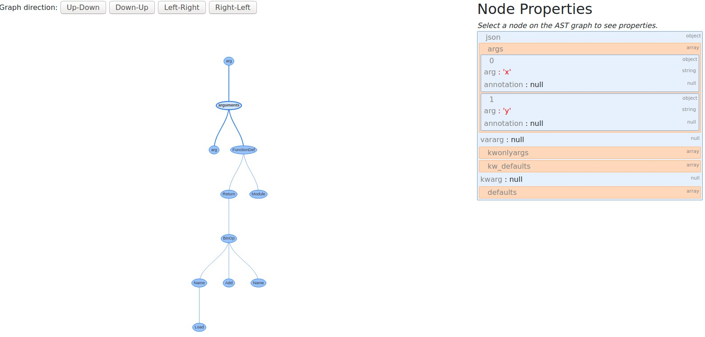  
选择抽象语法树中的某个节点就能在左边看到他的json格式语法树。 
### 中间代码(字节码)生成

#### 将AST转化为字节码
在得到python程序的AST后，编译生成中间代码字节码的最后一步就是要将AST转化为字节码。这一步的主要过程发生在`Python/complie.c`中，在`PyAST_Compile()`函数中进行抽象语法树到字节码的转化。而这个过程分为以下几步：  
1.检查future statements。这一步的目的是为了解析在python之后版本可能出现的新类型，实现了__future__模块，能够把下一个新版本的特性导入到当前版本，主要代码位于`Python/future.c`中。我们在这里不过多的阐述。  
2.建立一个符号表。符号表的目的是提供一个名称空间，全局变量和局部变量的列表，供编译器用于引用和解析范围。建立符号表的过程在`Python/symtable.c`文件中，通过`PySymtable_BuildObject()`函数实现，而每种符号的定义在`Include/symtable.h`中。  
 我们可以使用下面代码查看符号表的具体内容  
 ```
import symtable
s = symtable.symtable('a * b + 1', filename='test.py', compile_type='eval')
print([symbol.__dict__ for symbol in s.get_symbols()])
 ```
 输出：
```
[{'_Symbol__name': 'a', '_Symbol__flags': 6160, '_Symbol__scope': 3, '_Symbol__namespaces': ()}, {'_Symbol__name': 'b', '_Symbol__flags': 6160, '_Symbol__scope': 3, '_Symbol__namespaces': ()}]
```
3.生成basic blocks并组装成字节码。 调用`Python/complie.c`中的`editor_mod()`生成basic blocks并调用`Python/complie.c`中的`assemble()`函数使用dfs的方法对块进行搜索并组装成字节码。  
流程代码：  
```
static PyCodeObject *
compiler_mod(struct compiler *c, mod_ty mod)
{
    PyCodeObject *co;
    int addNone = 1;
    static PyObject *module;
    ...
    switch (mod->kind) {
    case Module_kind:
        if (!compiler_body(c, mod->v.Module.body)) {
            compiler_exit_scope(c);
            return 0;
        }
        break;
    case Interactive_kind:
        ...
    case Expression_kind:
        ...
    case Suite_kind:
        ...
    ...
    co = assemble(c, addNone);
    compiler_exit_scope(c);
    return co;
}
```
4.字节码优化。字节码在发送到`PyCode_Optimize()`之前先发送到`PyCode_NewWithPosOnlyArgs()`。字节码优化过程的实现位于`Python/peephole.c`文件中。优化器会仔细检查字节码指令，并在某些情况下将其替换为其他指令。例如，有一个名为`constant unfolding`的优化程序,会对`a=2+3`这种语句直接优化成`a=5`。   

最后让我们简单的查看下python字节码的具体形式。我们先以下面程序为例子查看他的字节码。  

```
def example(a):
    x=a+2*a
    if x<3:
        return "x<3"
    else:
        return  "x>=3"
print(example.__code__)
print(example.__code__.co_code) # the bytecode as raw bytes
print(list(example.__code__.co_code)) # the bytecode as numbers
```
输出结果  
```
<code object example at 0x7f25b65c5520, file "./example.py", line 1>
b'|\x00d\x01|\x00\x14\x00\x17\x00}\x01|\x01d\x02k\x00r\x18d\x03S\x00d\x04S\x00d\x00S\x00'
[124, 0, 100, 1, 124, 0, 20, 0, 23, 0, 125, 1, 124, 1, 100, 2, 107, 0, 114, 24, 100, 3, 83, 0, 100, 4, 83, 0, 100, 0, 83, 0]
```
在这里我们编译了`example`函数，`example.__code__`是与其关联的code object，而`cond.__code__.co_code`就是它的字节码。当我们直接输出这个字节码，它看起来完全无法理解,但很幸运的是我们可以使用Python标准库中的dis模块，他是一个字节码反汇编器。反汇编器以为机器而写的底层代码作为输入，比如汇编代码和字节码，然后以人类可读的方式输出。当我们运行dis.dis, 它输出每个字节码的解释。我们接下来就可以把字节码输入进去查看效果。在之前代码基础上增加  
```
import dis
dis.dis(example)
```
得到输出  
```
  2           0 LOAD_FAST                0 (a)
              2 LOAD_CONST               1 (2)
              4 LOAD_FAST                0 (a)
              6 BINARY_MULTIPLY
              8 BINARY_ADD
             10 STORE_FAST               1 (x)

  3          12 LOAD_FAST                1 (x)
             14 LOAD_CONST               2 (3)
             16 COMPARE_OP               0 (<)
             18 POP_JUMP_IF_FALSE       24

  4          20 LOAD_CONST               3 ('x<3')
             22 RETURN_VALUE

  6     >>   24 LOAD_CONST               4 ('x>=3')
             26 RETURN_VALUE
             28 LOAD_CONST               0 (None)
             30 RETURN_VALUE
```
这些都是什么意思？让我们以第一条指令`LOAD_FAST`为例子。第一列的数字`2`表示对应源代码的行数。第二列的数字是字节码的索引，告诉我们指令``LOAD_FAST`在`0`位置。第三列是指令本身对应的人类可读的名字。如果第四列存在，它表示指令的参数。如果第五列存在，它是一个关于参数是什么的提示。  

考虑这个字节码的前几个字节：[124, 0, 100, 1, 124, 0]。这6个字节表示两条带参数的指令。我们可以使用dis.opname，一个字节到可读字符串的映射，来找到指令124,100分别代表什么：  
```
>>> dis.opname[124]
'LOAD_FAST'
>>> dis.opname[100]
'LOAD_CONST'
```
可以看到这与我们使用dis反汇编模块的结果一致，然后这里的0，1，0分别为三条指令的参数。  
我们再重新看一下`x=a+a*2`这行代码对应的字节码,由于这位于第二行，我们可以很容易找到这行的字节码：  
```
  2           0 LOAD_FAST                0 (a)
              2 LOAD_CONST               1 (2)
              4 LOAD_FAST                0 (a)
              6 BINARY_MULTIPLY
              8 BINARY_ADD
             10 STORE_FAST               1 (x)
```
python解释器是一个栈机器，所以它必须通过操作栈来完成这个加法。解释器先执行第一条指令，`LOAD_FAST`，把第一个数`a`压到栈中。接着`LOAD_CONST`把第二个数`2`也压到栈中。然后,第三条指令`LOAD_FAST`继续把第三个数`a`压入栈中。之后，`BINARY_MULTIPLY`,先把两个数`2`,`a`从栈中弹出，相乘，再把结果压入栈中。然后一样的， `BINARY_ADD`将`a`和`2*a`从栈中弹出，相加，再把结果压入栈中。最后把结果弹出并赋给`x`。


#### 编译结果 PyCodeObject

​	PyCodeObject为Python编译后的结果，结构如下：

```C
typedef struct {
    PyObject_HEAD
    int co_argcount;            /* #arguments, except *args */
    int co_posonlyargcount;     /* #positional only arguments */
    int co_kwonlyargcount;      /* #keyword only arguments */
    int co_nlocals;             /* #local variables */
    int co_stacksize;           /* #entries needed for evaluation stack */
    int co_flags;               /* CO_..., see below */
    int co_firstlineno;         /* first source line number */
    PyObject *co_code;          /* instruction opcodes */
    PyObject *co_consts;        /* list (constants used) 常量*/
    PyObject *co_names;         /* list of strings (names used) */
    PyObject *co_varnames;      /* tuple of strings (local variable names) 局部变量名集合*/
    PyObject *co_freevars;      /* tuple of strings (free variable names) 实现闭包所需要的东西*/
    PyObject *co_cellvars;      /* tuple of strings (cell variable names) 内部嵌套函数所引用的局部变量名集合*/
    /* The rest aren't used in either hash or comparisons, except for co_name,
       used in both. This is done to preserve the name and line number
       for tracebacks and debuggers; otherwise, constant de-duplication
       would collapse identical functions/lambdas defined on different lines.
    */
    Py_ssize_t *co_cell2arg;    /* Maps cell vars which are arguments. */
    PyObject *co_filename;      /* unicode (where it was loaded from) */
    PyObject *co_name;          /* unicode (name, for reference) */
    PyObject *co_lnotab;        /* string (encoding addr<->lineno mapping) See
                                   Objects/lnotab_notes.txt for details. */
    void *co_zombieframe;       /* for optimization only (see frameobject.c) */
    PyObject *co_weakreflist;   /* to support weakrefs to code objects */
    /* Scratch space for extra data relating to the code object.
       Type is a void* to keep the format private in codeobject.c to force
       people to go through the proper APIs. */
    void *co_extra;

    /* Per opcodes just-in-time cache
     *
     * To reduce cache size, we use indirect mapping from opcode index to
     * cache object:
     *   cache = co_opcache[co_opcache_map[next_instr - first_instr] - 1]
     */

    // co_opcache_map is indexed by (next_instr - first_instr).
    //  * 0 means there is no cache for this opcode.
    //  * n > 0 means there is cache in co_opcache[n-1].
    unsigned char *co_opcache_map;
    _PyOpcache *co_opcache;
    int co_opcache_flag;  // used to determine when create a cache.
    unsigned char co_opcache_size;  // length of co_opcache.
} PyCodeObject;
```

​	编译过程中，每个code block都对应着一个PyCodeObject对象，即PyCodeObject包含该code block经过编译后得到的byte code序列。（Python规定每进入一个新的名字空间就视为进入一个新的code block。）

​	TODO：名字空间的解释（可参考《源码剖析》8.2），.pyc文件的简单介绍


## 执行

#### 执行环境（栈帧模拟）

​	虽然PyCodeObject包含了字节码序列和其他信息，但是却没有包含程序运行时的动态信息，因此在python执行的时候, 虚拟机实际上面对的不是一个 `PyCodeObject` 对象, 而是另一个 `PyFrameObject` 对象，它就是我们说的执行环境, 也是python在高级层次上对x86程序运行时栈帧的模拟。在汇编课程中我们学习到x86上程序运行方式如下：

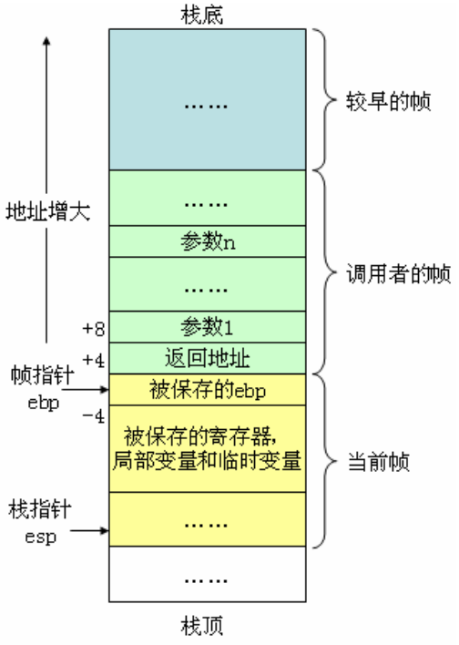

​	PyFrameObject结构如下：

```C

typedef struct _frame {
    PyObject_VAR_HEAD
    struct _frame *f_back;      /* previous frame, or NULL 使新的栈帧在结束之后可以顺利回到旧的栈帧中 */
    PyCodeObject *f_code;       /* code segment */
    PyObject *f_builtins;       /* builtin symbol table (PyDictObject) */
    PyObject *f_globals;        /* global symbol table (PyDictObject) */
    PyObject *f_locals;         /* local symbol table (any mapping) */
    PyObject **f_valuestack;    /* 运行时栈的栈底位置 points after the last local */
    /* Next free slot in f_valuestack.  Frame creation sets to f_valuestack.
       Frame evaluation usually NULLs it, but a frame that yields sets it
       to the current stack top. */
    PyObject **f_stacktop;      /* 运行时栈的栈顶位置 */
    PyObject *f_trace;          /* Trace function */
    char f_trace_lines;         /* Emit per-line trace events? */
    char f_trace_opcodes;       /* Emit per-opcode trace events? */

    /* Borrowed reference to a generator, or NULL */
    PyObject *f_gen;

    int f_lasti;                /* Last instruction if called */
    /* Call PyFrame_GetLineNumber() instead of reading this field
       directly.  As of 2.3 f_lineno is only valid when tracing is
       active (i.e. when f_trace is set).  At other times we use
       PyCode_Addr2Line to calculate the line from the current
       bytecode index. */
    int f_lineno;               /* Current line number */
    int f_iblock;               /* index in f_blockstack */
    char f_executing;           /* whether the frame is still executing */
    PyTryBlock f_blockstack[CO_MAXBLOCKS]; /* for try and loop blocks */

    // 动态内存，维护 局部变量+cell对象集合+free对象集合+运行时栈 所需的空间
    PyObject *f_localsplus[1];  /* locals+stack, dynamically sized */
} PyFrameObject;
```

​	相比于x86下的栈帧，PyFrameObject所包含的信息更多，下面依次分析其中的部分关键成员变量。

​	f_code：存放着待执行的PyCodeObject，可以看到每一个PyFrameObject对象都维护一个PyCodeObject对象，说明一个PyFrameObject是对应着一个code block。

​	f_back：指向上一个PyFrameObject，在实际执行过程中，会把很多个PyFrameObject连接起来，使得新的栈帧在结束之后可以顺利回到旧的栈帧中

​	f_builtins、f_globals、f_locals 分别代表内置symbol table，全局symbol table和局部symbol table，他们均为PyDictObject。

​	运行时环境组织如下，与x86运行时连续的内存空间不同，Python虚拟机运行的时候是离散的内存空间，通过链表串连起来。

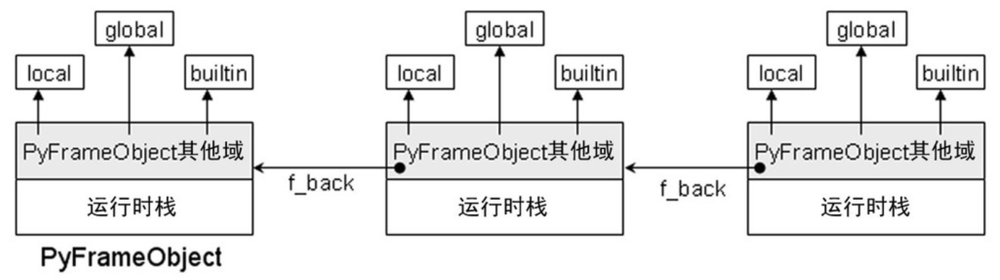

#### 虚拟机框架（模拟CPU）

​	执行流程为模拟CPU，进入for循环, 取出第一条字节码之后, 判断指令后执行, 然后一条接一条的从字节流中获取。

​	TODO：稍微结合代码说明一下

#### 运行环境（线程、进程）

​	Python在执行时，可能会有多个线程存在。Python虚拟机是对CPU的模拟因此可以把他看做软CPU，Python中的所有线程都使用这个软CPU来完成计算工作。真实机器上的任务切换机制对应到Python中，就是使不同的线程轮流使用虚拟机的机制。
​	CPU切换任务时需要保存线程运行环境。对于Python来说，在切换线程之前，同样需要保存关于当前线程的信息。线程状态信息的抽象是通过 `PyThreadState` 对象来实现的, 一个线程将拥有一个`PyThreadState`对象。 `PyThreadState`不是对线程的模拟, 而是对线程状态的抽象。 python的线程仍然使用操作系统的原生线程。对于进程的抽象, 由 `PyInterPreterState` 对象来实现。

​	通常情况下, python只有一个interpreter, 其中维护了一个或多个PyThreadState对象, 这些对象对应的线程轮流使用上面提到的软CPU。 为了实现线程同步, python通过一个全局解释器锁GIL。

​	TODO：稍微介绍一下GIL，包括提出的原因，优缺点等。

​	PyThreadState结构体定义如下：

```C
struct _ts {
    /* See Python/ceval.c for comments explaining most fields */

    struct _ts *prev;
    struct _ts *next;
    PyInterpreterState *interp;

    struct _frame *frame;   // 模拟线程中的函数调用堆栈
    int recursion_depth;
    char overflowed; /* The stack has overflowed. Allow 50 more calls
                        to handle the runtime error. */
    char recursion_critical; /* The current calls must not cause
                                a stack overflow. */
    int stackcheck_counter;

    /* 'tracing' keeps track of the execution depth when tracing/profiling.
       This is to prevent the actual trace/profile code from being recorded in
       the trace/profile. */
    int tracing;
    int use_tracing;

    Py_tracefunc c_profilefunc;
    Py_tracefunc c_tracefunc;
    PyObject *c_profileobj;
    PyObject *c_traceobj;

    /* The exception currently being raised */
    PyObject *curexc_type;
    PyObject *curexc_value;
    PyObject *curexc_traceback;

    /* The exception currently being handled, if no coroutines/generators
     * are present. Always last element on the stack referred to be exc_info.
     */
    _PyErr_StackItem exc_state;

    /* Pointer to the top of the stack of the exceptions currently
     * being handled */
    _PyErr_StackItem *exc_info;

    PyObject *dict;  /* Stores per-thread state */

    int gilstate_counter;

    PyObject *async_exc; /* Asynchronous exception to raise */
    unsigned long thread_id; /* Thread id where this tstate was created */

    int trash_delete_nesting;
    PyObject *trash_delete_later;

    /* Called when a thread state is deleted normally, but not when it
     * is destroyed after fork().
     * Pain:  to prevent rare but fatal shutdown errors (issue 18808),
     * Thread.join() must wait for the join'ed thread's tstate to be unlinked
     * from the tstate chain.  That happens at the end of a thread's life,
     * in pystate.c.
     * The obvious way doesn't quite work:  create a lock which the tstate
     * unlinking code releases, and have Thread.join() wait to acquire that
     * lock.  The problem is that we _are_ at the end of the thread's life:
     * if the thread holds the last reference to the lock, decref'ing the
     * lock will delete the lock, and that may trigger arbitrary Python code
     * if there's a weakref, with a callback, to the lock.  But by this time
     * _PyRuntime.gilstate.tstate_current is already NULL, so only the simplest
     * of C code can be allowed to run (in particular it must not be possible to
     * release the GIL).
     * So instead of holding the lock directly, the tstate holds a weakref to
     * the lock:  that's the value of on_delete_data below.  Decref'ing a
     * weakref is harmless.
     * on_delete points to _threadmodule.c's static release_sentinel() function.
     * After the tstate is unlinked, release_sentinel is called with the
     * weakref-to-lock (on_delete_data) argument, and release_sentinel releases
     * the indirectly held lock.
     */
    void (*on_delete)(void *);
    void *on_delete_data;

    int coroutine_origin_tracking_depth;

    PyObject *async_gen_firstiter;
    PyObject *async_gen_finalizer;

    PyObject *context;
    uint64_t context_ver;

    /* Unique thread state id. */
    uint64_t id;

    /* XXX signal handlers should also be here */

};
```

​	下面依次分析其中的部分关键成员变量。

​	frame: 栈帧列表，模拟线程中函数调用堆栈。

​	当Python虚拟机开始执行时，会将当前线程状态对象中的frame设置为当前的执行环境（frame）。

​	

​	PyInterPreterState结构定义如下：

```C
struct _is {

    struct _is *next;
    struct _ts *tstate_head; // 模拟进程环境中的线程集合

    int64_t id;
    int64_t id_refcount;
    int requires_idref;
    PyThread_type_lock id_mutex;

    int finalizing;

    PyObject *modules;
    PyObject *modules_by_index;
    PyObject *sysdict;
    PyObject *builtins;
    PyObject *importlib;

    /* Used in Python/sysmodule.c. */
    int check_interval;

    /* Used in Modules/_threadmodule.c. */
    long num_threads;
    /* Support for runtime thread stack size tuning.
       A value of 0 means using the platform's default stack size
       or the size specified by the THREAD_STACK_SIZE macro. */
    /* Used in Python/thread.c. */
    size_t pythread_stacksize;

    PyObject *codec_search_path;
    PyObject *codec_search_cache;
    PyObject *codec_error_registry;
    int codecs_initialized;

    /* fs_codec.encoding is initialized to NULL.
       Later, it is set to a non-NULL string by _PyUnicode_InitEncodings(). */
    struct {
        char *encoding;   /* Filesystem encoding (encoded to UTF-8) */
        char *errors;     /* Filesystem errors (encoded to UTF-8) */
        _Py_error_handler error_handler;
    } fs_codec;

    PyConfig config;
#ifdef HAVE_DLOPEN
    int dlopenflags;
#endif

    PyObject *dict;  /* Stores per-interpreter state */

    PyObject *builtins_copy;
    PyObject *import_func;
    /* Initialized to PyEval_EvalFrameDefault(). */
    _PyFrameEvalFunction eval_frame;

    Py_ssize_t co_extra_user_count;
    freefunc co_extra_freefuncs[MAX_CO_EXTRA_USERS];

#ifdef HAVE_FORK
    PyObject *before_forkers;
    PyObject *after_forkers_parent;
    PyObject *after_forkers_child;
#endif
    /* AtExit module */
    void (*pyexitfunc)(PyObject *);
    PyObject *pyexitmodule;

    uint64_t tstate_next_unique_id;

    struct _warnings_runtime_state warnings;

    PyObject *audit_hooks;
};
```

​	进程, 线程, 栈帧关系大致如下:

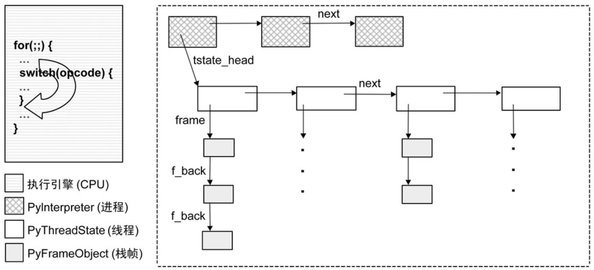

#### 存储组织与分配

##### 内存管理架构

​	CPython的内存管理采用层次化的思想，可分为五层，从高到低分别如下：

- Layer 3 特定对象的内存管理
- Layer 2 Python对象的内存管理
- Layer 1 Python虚拟机的内存管理
- Layer 0 操作系统提供的内存管理接口

​	最底层是操作系统提供的内存管理接口，比如C语言的malloc和free等接口，这一层由操作系统控制，Python控制的是上面三层。

​	TODO

##### 存储组织与分配策略

​	TODO


TODO：

多线程机制

内存管理机制


## 部分类型的含义

### <a name="mod_ty">mod_ty</a>

Python中5种模块类型之一的容器结构，是AST的实例，包含有：

1. `Module`
2. `Interactive`
3. `Expression`
4. `FunctionType`
5. `Suite`

### <a name="PyObject">PyObject</a>

所有Python的对象都是PyObject的拓展，包含着把一个指针转化为对象的所有信息。所有对象都可以转化为PyObject*，对对象成员的访问需要使用 Py_TYPE和Py_REFCNT。


## 部分宏的含义

### <a name="ADDOP_JABS">ADDOP_JABS</a>

**ADD** **O**peration with **J**ump to an **ABS**olute position

### ADDOP_JREL

**ADD** **O**peration with **J**ump to a **REL**ative position

### <a name="Py_TYPE()">Py_TYPE</a>

用于访问`PyObject`中的 `ob_type` 

```
(((PyObject*)(o))->ob_type)
```

### Py_REFCNT(o)

用于访问`PyObject`中的 `ob_refcnt`

```
(((PyObject*)(o))->ob_refcnt)
```

## 参考资料

- [cpython-source-code-guide](cpython-source-code-guide)

- [《Python源码剖析》](https://read.douban.com/reader/ebook/1499455/)

- [Python 3.8 官方文档](https://docs.python.org/3.8/c-api/index.html)