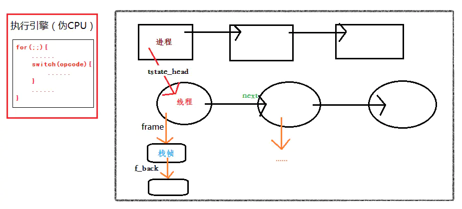

# Cpython源码阅读笔记

*该仓库中的assets文件夹用来储存markdown中的图片*

> Cpython代码命名规则:
>
> -  `Py` 前缀为公共函数, 非静态函数. Py\_前缀保留用于Py_FatalError等全局服务例程。特定的对象（如特定的对象类型API）使用较长的前缀，例如PyString_用于字符串函数。
> - 公共函数使用大小写混合和下划线，如: `PyObject_GetAttr`, `Py_BuildValue`, `PyExc_TypeError`.
> - 有时，加载器必须能够看到内置函数。使用\_Py前缀，例如_PyObject_Dump。
> - `宏需要使用大小写混合的前缀然后使用大写`，如`PyString_AS_STRING`, `Py_PRINT_RAW`.


## 整体运行流程


1. 

### 运行方式

#### -c

```
./python -c "print('hi')"
```


1.  `pymain_run_command()`中调用`PyUnicode_FromWideChar()`把-c之后的参数从wchar_t *（int *)转化为str。

#### -m

## 初始配置 

### init

1. Python/initconfig.c中 `config_read_env_vars` 函数读取环境变量。

## 编译

​	整体流程分为两步：

1. 遍历树并创建一个控制流图，它表示执行的逻辑顺序
2. 将CFG中的节点转换为更小的可执行语句，即字节码

### 前端

#### Tokens

python实现的tokenize位于 Lib/tokenize.py。

#### Grammer

pegn通过Grammer文件生成解析表，如果修改了Grammer文件，需要重新生成解析表。

pege: EBNF -> NFA -> DFA。


**步骤**

1. Python/pythonrun.c/`PyRun_FileExFlags()`
   1. `PyParser_ASTFromFileObject()`把FILE句柄转化为mod, 类型为[mod_ty](#mod_ty)。
   2. `run_mod()`通过`PyAST_CompileObject`把mod转化为PyCodeObject，然后把其送入`run_eval_code_obj`函数。

### 后端


## 执行

#### 虚拟机框架

​	在python执行的时候, 虚拟机实际上面对的不是一个 `PyCodeObject` 对象, 而是另一个 `PyFrameObject` 对象. 它就是我们说的执行环境, 也是python在系统上对栈帧的模拟。

​	执行流程为模拟CPU，进入for循环, 取出第一条字节码之后, 判断指令后执行, 然后一条接一条的从字节流中获取。

​	线程状态信息的抽象是通过 `PyThreadState` 对象来实现的, 一个线程将拥有一个`PyThreadState`对象. `PyThreadState`不是对线程的模拟, 而是对线程状态的抽象. python的线程仍然使用操作系统的原生线程.对于进程的抽象, 由 `PyInterPreterState` 对象来实现.

​	通常情况下, python只有一个interpreter, 其中维护了一个或多个PyThreadState对象, 这些对象对应的线程轮流使用一个字节码执行引擎. 为了实现线程同步, python通过一个全局解释器锁GIL.

​	进程, 线程, 栈帧布局大致如下:




## 部分类型的含义

### <a name="mod_ty">mod_ty</a>

Python中5种模块类型之一的容器结构，是AST的实例，包含有：

1. `Module`
2. `Interactive`
3. `Expression`
4. `FunctionType`
5. `Suite`

### <a name="PyObject">PyObject</a>

所有Python的对象都是PyObject的拓展，包含着把一个指针转化为对象的所有信息。所有对象都可以转化为PyObject*，对对象成员的访问需要使用 Py_TYPE和Py_REFCNT。


## 部分宏的含义

### <a name="ADDOP_JABS">ADDOP_JABS</a>

**ADD** **O**peration with **J**ump to an **ABS**olute position

### ADDOP_JREL

**ADD** **O**peration with **J**ump to a **REL**ative position

### <a name="Py_TYPE()">Py_TYPE</a>

用于访问`PyObject`中的 `ob_type` 

```
(((PyObject*)(o))->ob_type)
```

### Py_REFCNT(o)

用于访问`PyObject`中的 `ob_refcnt`

```
(((PyObject*)(o))->ob_refcnt)
```